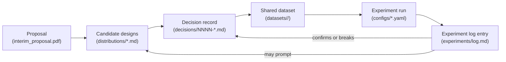

# Documents

This is the durable record of the project: what was proposed, what was
decided, and what was run — kept separate from `outputs/` (gitignored,
disposable) and from chat/planning transcripts (not part of the repo at
all). Shared session data for the team lives under
[`datasets/`](../datasets/), which is tracked in git.

```text
documents/
  README.md                 <- this file
  interim_proposal.pdf       proposal submitted for the course
  distributions/             candidate designs, pending a decision
    graph_distributions.md
  decisions/                 permanent, numbered decision records (ADR-style)
    README.md
    template.md
    NNNN-*.md                created once a decision is actually locked
  experiments/                what was run, and small result summaries
    README.md
    log.md
    results/<run-id>/
```

Sibling of this tree:

```text
datasets/                    shared train/val/test JSONL (tracked)
configs/                     reproducible experiment configs
outputs/                     local checkpoints and scratch (gitignored)
```

## How these fit together



- **Proposal** (`interim_proposal.pdf`) states the question and method at a
  point in time. It does not get edited as the project evolves.
- **Candidate designs** (`distributions/`, and future files like it for
  other open questions) lay out options with pros/cons before anything is
  locked. These are living documents until a decision is made.
- **Decision records** (`decisions/`) are short, permanent, numbered
  records of the actual choices made — see
  [`decisions/README.md`](decisions/README.md) for when to write one.
- **Shared datasets** ([`datasets/`](../datasets/)) hold the session JSONL
  teammates train and evaluate on. Configs point `data_dir` here.
- **Experiment log** (`experiments/`) records what was actually run against
  those decisions, and with what result — see
  [`experiments/README.md`](experiments/README.md).

## Rule of thumb

If you are about to run something that assumes a choice (a graph
distribution, a dataset scale, a set of eval conditions) that is not yet
in `decisions/`, either write the decision record first or mark the run as
exploratory in `experiments/log.md`. If you are about to make a choice that
future runs will assume is stable, write it down in `decisions/` instead of
leaving it in a chat transcript. Put released sessions under `datasets/`,
not only under `outputs/`.
