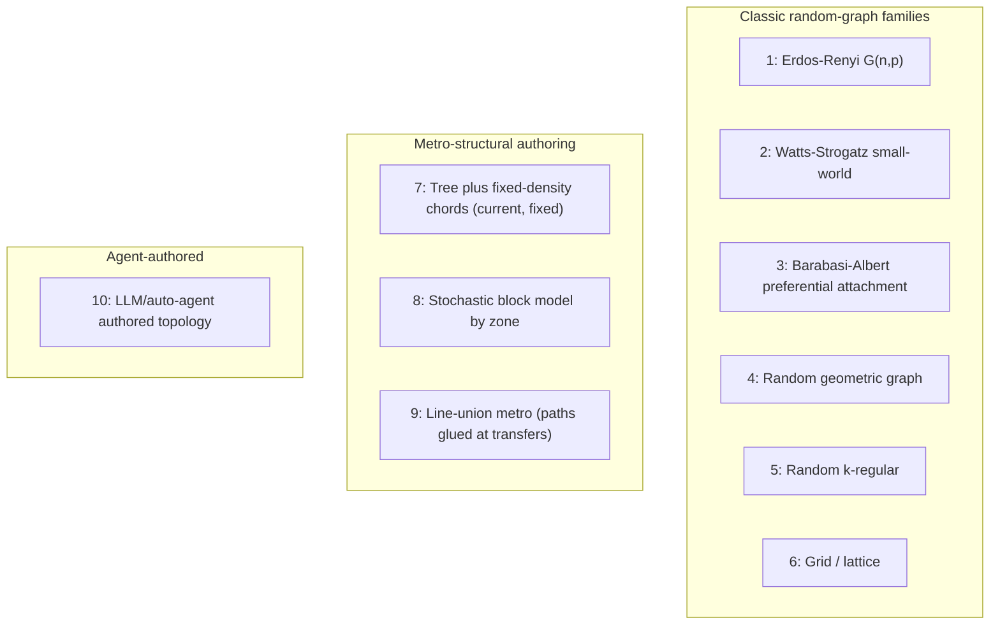

# Candidate graph distributions for experiment 1

Status: decided. Option 2 (Watts-Strogatz) is locked as
`watts_strogatz_metro_v1` — see
[`documents/decisions/0001-graph-distribution.md`](../decisions/0001-graph-distribution.md)
for the binding parameters, the measured characterization, and the
consequences. This file is kept as the record of what was considered and why;
the nine unchosen options remain here for the out-of-distribution follow-up
and for any later change of family, which would need a new decision record.

## Context

This is the first, in-distribution feasibility experiment (see
[`documents/interim_proposal.pdf`](../interim_proposal.pdf) and the root
[`README.md`](../../README.md)). The only job of the graph distribution is to
reliably produce graphs where a legal edit changes a solver-computed answer,
with controllable alt-path richness, so the eval conditions
(`oracle_updated_graph`, `cached_no_reencode`, `frozen_graph_history`, etc. in
[`src/graph_modi/evaluation/runner.py`](../../src/graph_modi/evaluation/runner.py))
are actually informative. It does not need to be a realistic metro.

The generator these options were compared against (the pre-decision
`_make_graph` in
[`src/graph_modi/data/multiturn.py`](../../src/graph_modi/data/multiturn.py))
was a random recursive tree plus independent-`p=0.12` extra edges, with
`line`/`zone`/`accessible` painted independently of structure. Measured
empirically: at smoke scale (`n=8-10`) 52% of "close a station on the
shortest path" edits made the pair unreachable; at full scale (`n=15-30`)
only 6% did, and diameter stayed ~4 at both scales because density was not
`n`-normalized. That scale-dependence is what the decision below fixes.

## 1. Erdos-Renyi G(n, p)

Each of the `n(n-1)/2` possible edges present independently with probability
`p`.

Pros:
- One parameter, trivial to implement and to describe/cite.
- Well-understood connectivity threshold (`p > ln(n)/n` gives connected
  whp), so you can tune "mostly connected" precisely.

Cons:
- No community/line structure at all; degree distribution is narrow
  (Poisson), which is unlike any transit network and gives no story for
  `line`/`zone` attributes.
- Near the connectivity threshold, small `n` swings between "too sparse,
  everything disconnects" and "too dense, nothing ever changes" — hard to
  hit a stable middle for both `n=8` and `n=30`.

Generation sketch: sample `n`, compute `p = c * ln(n) / n` for a fixed
constant `c` (e.g. 1.5-2x threshold) so density scales correctly with `n`;
reject/resample if disconnected; reuse the existing `_candidate_edit` +
`_changed_query` search on top.

## 2. Watts-Strogatz small-world

Start from a ring where each node connects to its `k` nearest neighbors,
then rewire each edge with probability `p_rewire`.

Pros:
- Degree is nearly constant (`~k`) at every `n`, so smoke and full-scale
  graphs are the same regime — fixes the current smoke-vs-full mismatch
  directly.
- The ring gives "closing a station lengthens the trip" as the common case
  rather than "graph falls apart," which matches the proposal's "at least
  two paths" requirement.
- One clean citation, three parameters (`n, k, p_rewire`), easy to state in
  the report and to vary later for an out-of-distribution experiment
  (`p_rewire=0` = pure ring, `k=2` = near-cycle).

Cons:
- The ring backbone can look artificial if stations get literal names ("if
  it's a ring, why is it called a metro").
- Clustering/diameter are coupled to `p_rewire`; tuning both independently
  takes a short calibration pass.

Generation sketch: `n` from a small discrete set (e.g. `{16,20,24,28}`),
fixed `k=4`, `p_rewire=0.15`; reject disconnected draws (rare at this `k`);
attributes as today (`status`, `accessible`) but drop independent
`line`/`zone` or derive `line` from ring segments.

## 3. Barabasi-Albert preferential attachment

Grow the graph by attaching each new node to `m` existing nodes with
probability proportional to current degree.

Pros:
- Produces hub nodes, which gives a natural "transfer station" story for
  free.
- Widely known, one-parameter (`m`) family.

Cons:
- Heavy-tailed degree means a handful of hub nodes dominate almost all
  shortest paths; closing/deleting near a hub is a single cheap heuristic
  the model could learn ("if degree is high, closing it matters"), which
  risks a shortcut rather than genuine graph reasoning.
- Diameter is very small (`O(log n)`), so path-length answers cluster
  tightly (mostly 2-3), weakening the query-answer distribution.

Generation sketch: `m` in `{2,3}`, `n` as usual; identify hub vs. leaf nodes
at generation time and deliberately balance how many turns target hubs vs.
non-hubs so the dataset doesn't become "always edit the hub."

## 4. Random geometric graph

Place `n` points uniformly in a 2D region; connect pairs within radius `r`.

Pros:
- Gives an actual geometric story for `zone` (spatial quadrants) and
  "nearby stations," which is more defensible than today's independent zone
  label.
- Natural distance-based edge weights if you want weighted shortest path
  later.

Cons:
- Boundary effects (corner nodes have fewer neighbors) create irregular
  degree without a knob to fix it.
- Connectivity depends on both `n` and `r` jointly; more parameter
  interactions to calibrate than Watts-Strogatz.

Generation sketch: sample points in `[0,1]^2`, connect within radius `r`
chosen so mean degree matches the Watts-Strogatz target (~4); derive `zone`
from spatial quadrant instead of sampling it independently; reject
disconnected draws.

## 5. Random k-regular graph (configuration model)

Every node has exactly degree `k`, edges assigned by the configuration model
(with self-loop/multi-edge rejection).

Pros:
- Perfectly uniform degree at every `n` — the cleanest possible density
  control, no distribution shape to worry about.
- Simple to state and reproduce exactly.

Cons:
- No clustering or community structure at all — even less "metro-like" than
  Erdos-Renyi, since real transit lines create local clusters.
- Configuration-model sampling occasionally needs rejection/retries for
  small `n` or odd `n*k`.

Generation sketch: fix `k=4`; use `networkx.random_regular_graph(k, n,
seed)` or an equivalent stub-matching implementation; reject and resample on
disconnection (rare for `k>=3`).

## 6. Grid / lattice

2D grid (optionally with wraparound/torus, or a few random diagonal
shortcuts).

Pros:
- Fully deterministic structure — trivial to reason about by hand, useful
  as a sanity-check baseline before moving to a "real" random family.
- Guarantees multiple paths between most pairs (go around the block),
  directly satisfying the proposal's two-path requirement.

Cons:
- Too regular: an LLM or GNN can memorize "Manhattan distance" without
  using the graph tokens at all, which undermines the point of the
  experiment (is the model actually reading `G`?).
- Grids don't look like metro maps and are hard to name/label naturally.

Generation sketch: build an `sqrt(n) x sqrt(n)` grid, wrap edges
torus-style to avoid boundary artifacts, optionally rewire a small fraction
of edges (this converges toward option 2 with a grid backbone instead of a
ring).

## 7. Tree + fixed-density chords (minimal change to current code)

Keep the existing random recursive tree, but replace the fixed `p=0.12`
with a target of `round(alpha * n)` extra chords so mean degree is constant
across `n` instead of density being fixed.

Pros:
- Smallest possible diff from the current generator
  ([`src/graph_modi/data/multiturn.py`](../../src/graph_modi/data/multiturn.py))
  — low implementation risk, keeps existing tests mostly valid.
- Directly fixes the measured smoke-vs-full mismatch (mean degree 2.5 vs 4.3
  today) without a new algorithm.

Cons:
- Still an ad hoc family with no name/citation of its own; harder to defend
  in a report than Watts-Strogatz or Barabasi-Albert.
- Tree backbone still means a meaningful fraction of edges are "bridges,"
  so behavior is a blend of Erdos-Renyi-like and tree-like properties
  that's harder to characterize cleanly.

Generation sketch: same as today up to the spanning tree; then add exactly
`round(alpha * n)` uniformly random missing edges (dedup); calibrate `alpha`
so mean degree lands near 4 at both `n=8` and `n=30`.

## 8. Stochastic block model by zone

Partition `n` nodes into `z` blocks ("zones"); dense edge probability
`p_in` within a block, sparse `p_out` across blocks (a few "interchange"
edges).

Pros:
- Gives `zone` actual structural meaning instead of an independent random
  label — a zone genuinely becomes a cluster of stations, and cross-zone
  edges become genuine interchange/transfer points.
- Creates a natural "closing the one interchange edge disconnects two
  zones" counterfactual, which is a strong, interpretable edit.

Cons:
- More parameters to lock (`z, p_in, p_out`) and more ways to get an
  unbalanced or disconnected draw.
- If `p_out` is too low, whole zones can become unreachable from each other
  after one edit, which may be too dramatic/easy a counterfactual (majority
  answer becomes "unreachable").

Generation sketch: `z=3-4` zones of roughly `n/z` nodes each; `p_in` tuned
for mean intra-zone degree ~4-5; a small fixed number of inter-zone
"transfer" edges (2-3 per zone pair) so deleting one is meaningful but not
always catastrophic.

## 9. Line-union metro (paths/cycles glued at transfer stations)

Sample `L` lines, each a random path or short cycle of stations; glue lines
together by sharing a subset of nodes as transfer stations. `line` becomes
a real per-node set, not a random label.

Pros:
- The most defensible "metro" story of all ten — matches the paper's
  framing literally, and gives natural language a real referent ("the red
  line" is an actual line).
- Closing a transfer station or an edge on a line produces the clearest,
  most narratable counterfactual ("reroute via the other line").

Cons:
- Most implementation work of the ten options — needs its own generator,
  its own balance-checking (avoid one dominant line or a degenerate
  single-line graph), and its own characterization pass before it can be
  trusted.
- More parameters to get right (line count, line length, transfer density)
  means more risk of silently locking a bad instance of the family.

Generation sketch: sample `L=3-5` lines each of length `~n/L`; connect
consecutive stations on a line; pick a small number of shared transfer
nodes between line pairs; verify global connectivity; derive `line`
attribute directly from line membership (multi-valued at transfers).

## 10. LLM / auto-agent authored topology

Instead of a closed-form random model, give an autonomous agent a
structured prompt/spec (target `n`, degree bounds, connectivity
requirement, at least one pair with two edge-disjoint paths, station/line
naming conventions) and have it emit a graph as JSON
(`AttributedGraph`-shaped), then run it through the exact same solver +
`apply_edit` + `audit_sessions` pipeline used today.

Pros:
- Only option that can produce genuinely varied, "story-like" topologies
  and plausible station/line names without hand-authoring templates,
  potentially the best route to a natural-sounding revision utterance too
  (today's utterances are templated and weak).
- Because gold answers are still computed by the deterministic solver
  (never by the agent) and validated by the existing audit, agent-authored
  *structure* is safe even though the agent itself is non-deterministic —
  same safety net as every other option.

Cons:
- Not a "distribution" in the closed-form sense: no name, no fixed
  parameters, harder to characterize/report, and reproducibility depends on
  prompt + model version, not a seed alone.
- Cost, latency, and rate limits make generating thousands of graphs much
  slower/more expensive than any procedural family; also needs a stricter
  post-hoc validator (duplicate ids, self-loops, disconnected drafts,
  degree explosions) since the agent can violate constraints it was told to
  respect.
- Risk of the agent regressing to familiar real-world city topology
  (leaking latent world knowledge back into the "invented map" premise the
  proposal relies on).

Generation sketch: a system prompt fixes hard constraints (node/edge count
bounds, connectivity, naming pattern, JSON schema matching
`AttributedGraph.to_dict()`); the agent proposes structure + names; a
validator (reuse `validate_graph` from
[`src/graph_modi/graph/executor.py`](../../src/graph_modi/graph/executor.py))
rejects and re-prompts on any violation; accepted graphs feed into the
unchanged edit/query/solver loop in
[`src/graph_modi/data/multiturn.py`](../../src/graph_modi/data/multiturn.py).
Best used as a smaller supplementary/diversity set rather than the primary
bulk generator for a first feasibility pass, given cost and reproducibility
concerns.

## Recommendation (non-binding until recorded as a decision)

Rank for "lock one now, in-distribution, feasibility only":

1. **Watts-Strogatz (#2)** — best controllability-to-effort ratio, fixes
   the current scale mismatch, one clean citation, clear later-OOD story.
2. **Tree + fixed-density chords (#7)** — if minimizing code churn matters
   more than having a named family right now.
3. **Line-union metro (#9)** — best narrative fit to the proposal, worth it
   only if there's time to characterize it properly before generating bulk
   data.

Treat **LLM-agent authored graphs (#10)** as a parallel diversity/robustness
track, not the primary generator, for this first experiment — it doesn't
give a locked, reproducible distribution and adds cost/latency without
changing what's actually being tested (whether re-encoding an updated graph
beats text history).

## Decision

Option 2, Watts-Strogatz, accepted on 2026-08-21.

- Decision record: [`0001-graph-distribution.md`](../decisions/0001-graph-distribution.md)
- Locked distribution: `watts_strogatz_metro_v1`
- Locked parameters: `graph_degree: 4`, `rewire_probability: 0.15`,
  `line_count: 4`, node count from each config's existing
  `node_count_min`/`node_count_max` range
- Derived semantics: `line` from contiguous ring arcs, edge `relation` of
  `track` (ring) or `transfer` (rewired), `zone` removed, ring positions
  permuted onto node ids so adjacency is not recoverable from id arithmetic

Deciding argument: on a `k=4` ring the counterfactual the experiment measures
is a structural guarantee rather than a lucky draw. Closing a station leaves a
longer specific route instead of severing the map (0.1% unreachable at full
scale, down from 52% at smoke scale under the previous generator), and degree
is exactly 4 at every node count, so the smoke and full-scale sets are the
same family. The measured trade-off is that reachability and cycle-membership
counterfactuals become rare; see the record's Consequences.
