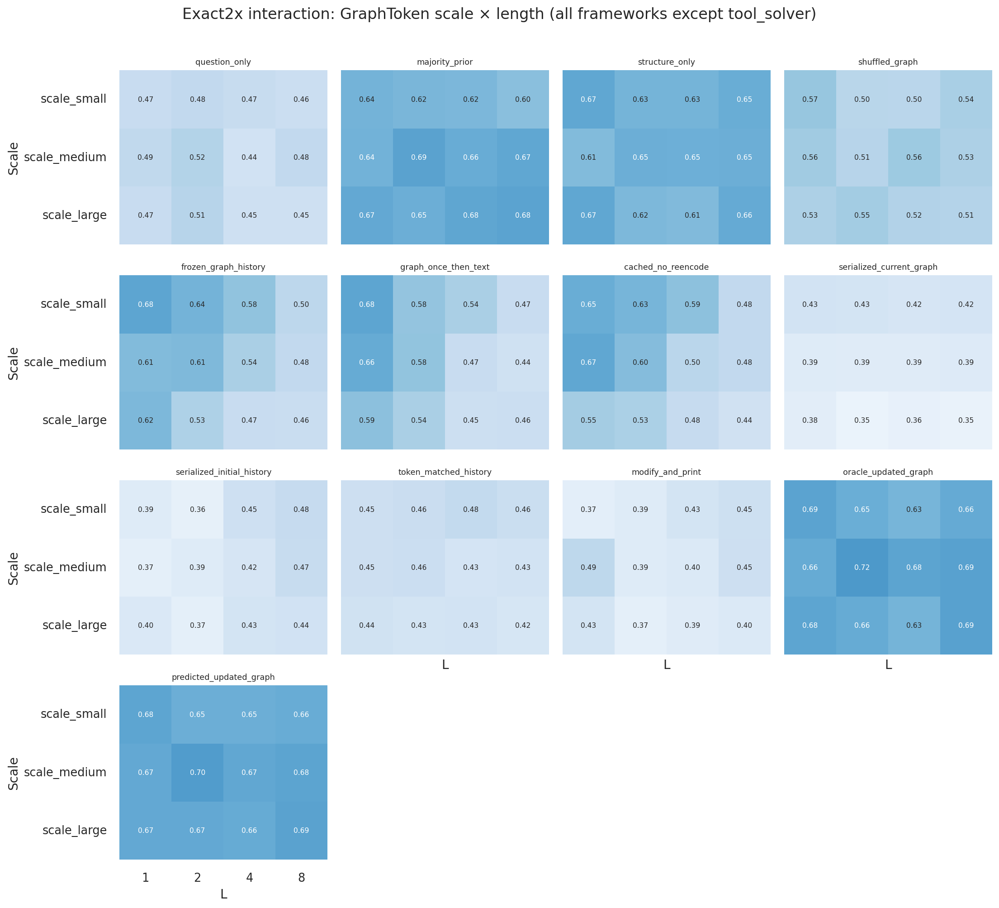

# Graph-Modi Status Report: Exact-Uniform 2× Eval

**Current eval run:** `v2_gate_variant_cf_exact2x-20260911`  
**Date:** 2026-09-11 (exact2x generate + evaluate + analyze)  
**Training run (checkpoints reused, no retrain):** `v2_gate_variant_cf-20260823`  
**Exact2x dataset:** [`datasets/metro_v2_gate_variant_cf_exact2x/`](../../datasets/metro_v2_gate_variant_cf_exact2x/)  
**Configs:** [`configs/v2_gate_variant_cf_exact2x_{tea,graphtoken,soft_prompt}.yaml`](../../configs/)  
**Canonical write-up:** [`results/v2_gate_variant_cf_exact2x-20260911/report.md`](results/v2_gate_variant_cf_exact2x-20260911/report.md)  
**Figures:** [`figures/exact2x_*.png`](figures/) (`scripts/analyze_exact2x_eval.py`)  
**Git:** `00ae618` (+ uncommitted exact_uniform generator / analyze / report at writing)

This report is the **current** status document. It centers on the exact-uniform 2× dynamic eval (fully crossed exact \(n\) × length × density × task). Prior CF (entangled OOD) and factorial (scale-bin × length) results remain under `results/` for history; short recaps are in [§0](#0-prior-evals-recap).

---

## 0. Prior evals (recap)

### 0.1 Original CF dynamic eval (`v2_gate_variant_cf-20260823`)

Entangled OOD: large graphs **and** 8-turn sessions together. Headline oracle ~**70–71%**, multimodal gain ~**+17pp**, edit ~**96%**. Complexity falloff was real but **not identifiable** as scale vs length. Full write-up: [`results/v2_gate_variant_cf-20260823/report.md`](results/v2_gate_variant_cf-20260823/report.md).

### 0.2 Factorial eval (`v2_gate_variant_cf_factorial-20260909`)

Crossed scale **bins** × session length (12 cells), density balanced inside cells; tasks still cycled within sessions. Oracle ~**60–62%**; scale clearer than length; multimodal gain ~**+7–8pp**. Full write-up: [`results/v2_gate_variant_cf_factorial-20260909/report.md`](results/v2_gate_variant_cf_factorial-20260909/report.md).

### 0.3 Why exact2x

Factorial still (a) sampled \(n\) inside bins and (b) cycled tasks by turn (`turn_index % 3`). Exact2x enumerates every `(exact n, L, density, task)` once per split and **fixes the task for the whole session**, so exact-size, density, length, and task trends are not confounded by within-session task switching.

---

## 1. Executive summary

Same CF-trained TEA / GraphToken / soft-prompt checkpoints; **eval-only** on `metro_v2_gate_variant_cf_exact2x` (val=test=936 sessions, **7020** turns/condition pooled).

| Claim | Result |
|---|---|
| Static oracle-QA gate (unchanged CF static) | TEA **77.4%** pass; GraphToken **77.1%** pass; soft-prompt **48.9%** fail (expected) |
| Re-encode after update beats text / soft-prompt | Oracle **65.2% / 67.0%** vs question_only **45.1% / 46.6%**, soft_prompt **49.9%** |
| Full GraphModi (`predicted_updated_graph`) | TEA **64.9%**, GraphToken **67.0%**; edit-exec **96.4% / 96.2%** |
| Oracle − GraphModi gap | **~0.3pp / ~0.0pp** (near-tie) |
| Multimodal gain (oracle − max(soft_prompt, structure_only)) | **+2.4pp / +2.5pp** — small because `structure_only` is already strong |
| Pooled majority prior | **65.1%** — **misleading** headline comparator (cycle yes-skew); see §8 |

**Complexity trends (absolute accuracy):** near-flat in session length and turn index; mild scale/density variation. This is **largely expected** under oracle-with-fresh-graph + label skew — not evidence that “hardness failed to increase.” See [§7.6](#76-why-trends-look-flat-holding-accuracy).

**Learning vs majority:** models are **not** majority-labelers (they under-predict `yes`; balanced accuracy beats majority; lift is concentrated on `edge_exists`). Pooled oracle ≈ majority is a **mix artifact**. See [§8.5](#85-majority-labeling-check).

**Claim boundary:** three-task yes/no diagnostic on Watts–Strogatz metro graphs; not a full CLEGR numeric/path claim.

### Exact2x figure gallery





---

## 2. Problem and hypotheses

Graph-Modi tests whether a frozen LLM with a trained graph adapter can:

1. **Parse** a natural-language revision into an executable edit program.
2. **Apply** that program to the current attributed metro graph.
3. **Re-encode** \(G_t\) and answer \(Q_t\) from the updated graph prefix (not from stale \(G_0\) + text history alone).

**Primary hypothesis (dynamic update):**  
`oracle_updated_graph` / `predicted_updated_graph` ≫ `frozen_graph_history`, `graph_once_then_text`, `cached_no_reencode`, and text-only baselines.

**Architecture comparison:** TEA-GLM-style (freeze GNN after pretrain; train projector) vs GraphToken-style (joint GNN+projector, warm-started from the same GNN checkpoint), matched LLM, GraphSAGE encoder, and **10** graph-prefix tokens.

**Admission test:** a soft-prompt model (learned \(10 \times d\) prompt, **no** GNN / topology) trained on the same corpus should fail the static gate and underperform full GLMs on dynamic eval.

**Exact2x-specific hypothesis (complexity):** once exact \(n\), length, density, and task are fully crossed, **scale** should remain a clearer hardness axis than **length** for oracle/predicted; turn-index should be **flatter** than under task-cycling; stale/frozen conditions (not oracle) should still degrade with turn depth.

---

## 3. Dataset design

### 3.1 Distribution and task mix

- **Distribution:** `metro_v2_preliminary` — fictional attributed Watts–Strogatz metro graphs.
- **Tasks:** `edge_exists`, `reachability`, `cycle_membership` only (yes/no gate tasks).
- **Task assignment:** **fixed for the entire session** from the factorial cell (no `turn_index % 3` cycling).
- **Topology:** Watts–Strogatz only.
- **Gold answers:** deterministic symbolic solvers (`tool_solver` = 100%).

### 3.2 Exact-uniform grid

| Axis | Levels |
|---|---|
| Exact \(n\) | small 16–24 (**9** sizes), medium 25–32 (**8**), large 40–48 (**9**) → **26** sizes |
| Session length \(L\) | 1, 2, 4, 8 |
| Density | sparse / medium / dense (**forced** target density) |
| Task | `edge_exists`, `reachability`, `cycle_membership` |

**1× cell count:** \(26 \times 4 \times 3 \times 3 = 936\) sessions / **3510** turns.  
**2× layout:** `validation` = 1×, `test` = 1× → **1872** sessions / **7020** turns.

Generator: `generate_exact_uniform_sessions` in [`src/graph_modi/data/v2.py`](../../src/graph_modi/data/v2.py); CLI `data.session_layout: exact_uniform` with `exact_uniform.{validation,test}_replicates`. Static CF corpus **copied** (`dynamic_only`); factorial dataset on disk is **not** overwritten.

### 3.3 Balance verification (both splits)

| Check | Validation | Test |
|---|---|---|
| Sessions / turns | 936 / 3510 | 936 / 3510 |
| Unique `(n, L, density, task)` cells | **936**, count **1** each | same |
| Fixed task per session | **936 / 936** | same |
| Density sessions | 312 / 312 / 312 | same |
| Task sessions | 312 / 312 / 312 | same |
| Exact \(n\) within bins | each size **36×** | same |
| Sparse present | yes | yes |
| Audit `valid` | true | true |

### 3.4 Label / edit composition (pooled val+test)

| Slice | yes rate | answer-changing | NOOP rate | majority-label ceiling |
|---|---|---|---|---|
| Overall | 57.2% | 34.9% | 38.3% | 57.2% (global yes) / **65.1%** (`majority_prior` condition) |
| `cycle_membership` | **73.6%** | 13.8% | 38.7% | **73.6%** (task maj ≈ 86.2% under `majority_prior`) |
| `edge_exists` | 40.3% | **52.1%** | 38.2% | 59.7% |
| `reachability` | 57.6% | 38.9% | 38.1% | 57.6% |
| dense / medium / sparse | **74.3%** / 58.9% / 38.4% | 28.1% / 33.0% / **43.8%** | ~38% | skew drives density trends |
| scale large / medium / small | 60.0% / 60.5% / 51.4% | 32.5% / 33.2% / 39.0% | ~37–40% | large looks “easier” for majority |

**Turn weight by \(L\)** (equal sessions per \(L\), unequal turns): \(L=1\to468\), \(2\to936\), \(4\to1872\), \(8\to3744\) turns. Length-stratified plots equalize sessions; other pooled axes overweight long sessions.

### 3.5 Complexity metadata notes

- `target_density` / `scale_bin` / `session_length` / `factorial_cell` / exact `node_count` are populated.
- **`hop_depth` is missing (NaN) on all 7020 turns** in this generation — hop-stratified CLEGR views are unavailable.
- Average degree by density × scale (approx.): sparse ~2 at all scales; medium ~2–6; dense ~12–26. Density changes connectivity far more than \(n\) alone in the sparse regime.

### 3.6 Static corpus (copied from CF)

| Split | Tuples |
|---|---|
| Static train | 15,992 |
| Static validation | 2,250 |
| Static test | 4,500 |

Counterfactual static train was used for the original CF training run; exact2x does **not** regenerate static.

### 3.7 Audit snapshot

| Split | Sessions | Turns | NOOP | CF pairs | Majority answer acc (audit) | Valid |
|---|---|---|---|---|---|---|
| Validation | 936 | 3510 | 1405 | 2105 | 58.0% | yes |
| Test | 936 | 3510 | 1287 | 2223 | 56.4% | yes |

Reasoning turns (each split): `edge_exists` / `reachability` / `cycle_membership` = **1170 / 1170 / 1170**.

Artifacts: [`results/v2_gate_variant_cf_exact2x-20260911/audit.json`](results/v2_gate_variant_cf_exact2x-20260911/audit.json).

---

## 4. Experimental setup

### 4.1 Shared backbone (unchanged from CF train)

| Setting | Value |
|---|---|
| LLM | Meta-Llama-3.1-8B-Instruct, bf16, frozen |
| Graph encoder | GraphSAGE (TEA: frozen after pretrain; GraphToken: joint) |
| Prefix tokens | 10 |
| Seed | 42 (generation / train); eval uses CF checkpoints |
| Eval splits | `validation`, `test` (no OOD split) |
| Retrain | **No** — CF checkpoints reused |

### 4.2 Models

| Model | Role |
|---|---|
| **TEA** | Freeze GNN; query-conditioned projector |
| **GraphToken** | Joint GNN+projector, warm-started from TEA GNN |
| **soft_prompt** | No GNN; learned \(10\times d\) soft prompt; same CF corpus |

### 4.3 Evaluation conditions

| Condition | Meaning |
|---|---|
| `oracle_updated_graph` | Gold edits applied; re-encode \(G_t\) |
| `predicted_updated_graph` | Model-predicted edits applied; re-encode (GraphModi) |
| `frozen_graph_history` | Stale \(G_0\) tokens + text history |
| `graph_once_then_text` / `cached_no_reencode` | No per-turn re-encode |
| `question_only` / `majority_prior` | Text / label baselines |
| `soft_prompt` | Separate checkpoint, no topology |
| `structure_only` / `shuffled_graph` | Topology ablations |
| `serialized_*` / `modify_and_print` / `token_matched_history` | Text-graph / history controls |
| `tool_solver` | Symbolic ceiling |

TEA/GraphToken run the full condition matrix; soft_prompt runs its own condition only.

---

## 5. Static gate (from CF training; unchanged)

Static eval was not re-run for exact2x (static corpus identical to CF). From the CF report:

| | TEA | GraphToken | soft_prompt |
|---|---|---|---|
| Overall accuracy | **77.4%** | **77.1%** | 48.9% |
| Gate (≥70%, no task &lt;50%) | Pass | Pass | **Fail** (`cycle_membership`, `reachability`) |
| `edge_exists` | 53.7% | 54.8% | 52.3% |
| `reachability` | 85.7% | 86.0% | 49.7% |
| `cycle_membership` | 92.8% | 90.5% | 44.8% |

Soft-prompt failure remains the intended admission result.

---

## 6. Main dynamic results

### 6.1 Turn-weighted overall (val+test pooled, n=7020 turns/condition)


| Condition | TEA | GraphToken |
|---|---|---|
| `question_only` | 45.1% | 46.6% |
| `majority_prior` | 65.1% | 65.1% |
| `soft_prompt` (own ckpt) | 49.9% | 49.9% |
| `shuffled_graph` | 51.4% | 52.9% |
| `structure_only` | 62.8% | 64.5% |
| `serialized_current_graph` | 39.0% | 38.9% |
| `serialized_initial_history` | 44.5% | 43.6% |
| `token_matched_history` | 44.2% | 44.2% |
| `frozen_graph_history` | 58.4% | 51.9% |
| `graph_once_then_text` | 48.3% | 49.2% |
| `cached_no_reencode` | 58.4% | 51.0% |
| `modify_and_print` | 60.6% | 41.8% |
| **`oracle_updated_graph`** | **65.2%** | **67.0%** |
| **`predicted_updated_graph`** | **64.9%** | **67.0%** |
| `tool_solver` | 100.0% | 100.0% |
| **Edit-prediction accuracy** | **96.4%** | **96.2%** |

**Oracle − GraphModi:** ~0.3pp (TEA) / ~0.0pp (GraphToken).  
**Oracle − question_only (paired mean Δ):** +20.1pp / +20.5pp.  
**Oracle − majority_prior (paired mean Δ):** +0.1pp / +2.0pp — **do not** treat as “no learning”; see §8.5.  
**Oracle − frozen_graph_history (paired mean Δ):** +6.8pp / +15.1pp (GT frozen is much weaker).  
**Multimodal gain:** oracle − max(soft_prompt 49.9%, structure_only) = **+2.4pp / +2.5pp**.

### 6.2 Per-split headline (Wilson 95% CI)

**TEA** (predicted edit_acc: val 0.965, test 0.964)

| Condition | Validation (n=3510) | Test (n=3510) |
|---|---|---|
| `question_only` | 0.450 [0.434,0.467] | 0.451 [0.435,0.468] |
| `majority_prior` | 0.661 [0.645,0.676] | 0.640 [0.624,0.656] |
| `structure_only` | 0.624 [0.608,0.640] | 0.631 [0.615,0.647] |
| `frozen_graph_history` | 0.581 [0.565,0.597] | 0.586 [0.570,0.602] |
| **`oracle_updated_graph`** | **0.646** [0.630,0.662] | **0.658** [0.642,0.673] |
| **`predicted_updated_graph`** | **0.645** [0.629,0.661] | **0.654** [0.638,0.669] |
| `tool_solver` | 1.000 | 1.000 |

**GraphToken** (predicted edit_acc: val 0.961, test 0.962)

| Condition | Validation (n=3510) | Test (n=3510) |
|---|---|---|
| `question_only` | 0.459 [0.442,0.475] | 0.473 [0.456,0.489] |
| `majority_prior` | 0.661 [0.645,0.676] | 0.640 [0.624,0.656] |
| `structure_only` | 0.644 [0.628,0.660] | 0.646 [0.630,0.662] |
| `frozen_graph_history` | 0.519 [0.502,0.535] | 0.520 [0.503,0.536] |
| **`oracle_updated_graph`** | **0.666** [0.651,0.682] | **0.674** [0.658,0.689] |
| **`predicted_updated_graph`** | **0.665** [0.649,0.681] | **0.675** [0.659,0.690] |
| `tool_solver` | 1.000 | 1.000 |

**soft_prompt:** val 0.493 [0.476,0.509]; test 0.504 [0.488,0.521]; pooled **0.499**.

Full condition × split tables: [§11.2](#112-per-split-answer-accuracy-wilson-95-ci).

---

## 7. Complexity trends

### 7.1 Scale


| scale_bin | TEA oracle | GT oracle | TEA majority | yes rate |
|---|---|---|---|---|
| `scale_small` | 0.648 | 0.654 | 0.610 | 0.514 |
| `scale_medium` | **0.677** | **0.689** | 0.668 | 0.605 |
| `scale_large` | 0.634 | 0.669 | **0.675** | 0.600 |

Medium easiest. Large hardest for TEA in absolute terms; **lift vs majority** is actually best on small (+3.8pp TEA) and **negative on large (−4.2pp TEA)** because majority rises with yes-skew on large graphs.

### 7.2 Exact \(n\) within bins


No single-size cliff. TEA oracle by exact \(n\) (each \(n\): 270 turns) ranges roughly **0.60–0.72** (e.g. \(n=26/27\) ~0.72; \(n=46\) ~0.60). Smooth within-bin variation — scaling is gradual, not a step at bin boundaries.

### 7.3 Session length


| \(L\) | TEA oracle | GT oracle | TEA maj | ans_chg | NOOP |
|---|---|---|---|---|---|
| 1 | 0.660 | 0.675 | 0.647 | 0.353 | 0.368 |
| 2 | 0.645 | 0.674 | 0.652 | 0.348 | 0.421 |
| 4 | 0.639 | 0.646 | 0.651 | 0.349 | 0.388 |
| 8 | 0.659 | 0.681 | 0.650 | 0.350 | 0.374 |

**Near-flat.** Answer-changing and NOOP rates barely move with \(L\). Session-mean TEA oracle (equal session weight) is also flat (0.66 / 0.65 / 0.64 / 0.66).

### 7.4 Scale × length interaction


Heatmaps above now cover **every framework except `tool_solver`** (one panel per condition). Oracle numbers for reference:

**TEA oracle**

| | \(L=1\) | 2 | 4 | 8 |
|---|---|---|---|---|
| scale_small | 0.667 | 0.633 | 0.639 | 0.654 |
| scale_medium | 0.701 | 0.688 | 0.667 | 0.676 |
| scale_large | 0.617 | 0.620 | 0.616 | 0.648 |

**GraphToken oracle**

| | \(L=1\) | 2 | 4 | 8 |
|---|---|---|---|---|
| scale_small | 0.685 | 0.651 | 0.630 | 0.664 |
| scale_medium | 0.660 | 0.715 | 0.682 | 0.690 |
| scale_large | 0.679 | 0.660 | 0.631 | 0.689 |

Medium remains strongest. Hardness is **not** uniquely “large and long” — large×short is often among the weaker TEA cells.

### 7.5 Density


| density | TEA oracle | GT oracle | yes rate | ans_chg |
|---|---|---|---|---|
| sparse | 0.609 | 0.616 | 0.384 | **0.438** |
| medium | 0.676 | 0.688 | 0.589 | 0.330 |
| dense | 0.671 | 0.707 | **0.743** | 0.281 |

Sparse looks hardest in absolute accuracy, but also has the most balanced / answer-changing labels. Dense looks easy partly because it is **74% yes**. Prefer lift / task-conditioned reads over raw density ranking.

### 7.6 Why trends look flat (“holding accuracy”)

Absolute oracle staying ~64–68% across length/turn is **not** mysterious:

1. **Oracle should not fall with \(L\).** Each turn re-encodes the true \(G_t\). Length hurts only via history confusion or edit failure. Edit accuracy ~96% ⇒ predicted ≈ oracle ⇒ **flat length curves are expected for oracle/predicted**.
2. **Stale/frozen still degrade (especially GraphToken).** On \(L=8\) only, GT `frozen_graph_history` falls **0.613 → 0.389** across turns 0–7; TEA frozen stays oddly flat (~0.56–0.61). The classic “falloff with turns” lives in **stale** conditions, not oracle.
3. **Absolute accuracy ≠ hardness.** Yes-rate and `majority_prior` move with scale/density; lifts can shrink while absolute acc looks stable.
4. **Task mix cancels.** `edge_exists` carries real lift; `cycle_membership` loses to majority; `reachability` ≈ majority. Pooled curves average them.
5. **`structure_only` ≈ oracle (~2–4pp).** Little room for “state-tracking collapse” curves if most signal is static structure reading.
6. **Hardness proxies barely ramp with \(L\):** ans_chg ~35%, NOOP ~38% across lengths; `hop_depth` unset; \(n\) only 16–48.

**How to read trends going forward:** prefer (a) `edge_exists` only, (b) answer-changing only, (c) oracle − majority / oracle − frozen, (d) balanced accuracy — not pooled absolute accuracy alone.

### 7.7 Turn index


Oracle/predicted are relatively flat (~0.64–0.71), consistent with **fixed task/session**. Unlike the CF report’s oscillation from task cycling, exact2x turn curves do not show the old dip pattern tied to `turn_index % 3`.

**\(L=8\) frozen (GT):** clear decay with turn depth (see §7.6). That is the condition where “holding accuracy” does **not** apply.

---

## 8. Fine-grained diagnostics

### 8.1 Reasoning type


| Task (n=2340 each) | TEA oracle / majority | GT oracle / majority | Lift (TEA / GT) |
|---|---|---|---|
| `edge_exists` | 0.617 / 0.479 | 0.624 / 0.479 | **+13.7 / +14.4pp** |
| `reachability` | 0.591 / 0.611 | 0.608 / 0.611 | −1.9 / −0.3pp |
| `cycle_membership` | 0.748 / 0.862 | 0.779 / 0.862 | **−11.4 / −8.2pp** |

Unambiguous state-tracking evidence is on **`edge_exists`**. Cycle absolute accuracy is weak evidence given an 86% majority baseline — models underperform majority there (they are not “leaning on” the cycle prior successfully).

**Task × scale lift (TEA oracle − majority):**

| | scale_small | scale_medium | scale_large |
|---|---|---|---|
| `edge_exists` | +0.185 | +0.186 | +0.046 |
| `reachability` | 0.000 | −0.017 | −0.041 |
| `cycle_membership` | −0.072 | −0.143 | −0.130 |

Scale hurts the **learning** task (`edge_exists`) most at large \(n\) (lift shrinks to +4.6pp).

### 8.2 Answer-changing turns


Restricted to turns where `gold_answer ≠ stale_answer` (**n=2453**, 34.9% of turns):

| | TEA | GraphToken |
|---|---|---|
| Accuracy | **55.7%** | **56.7%** |
| Pred matches stale | 43.5% | 43.3% |
| `yes→no` flips (n=1524) | acc **70.7%** | **70.9%** |
| `no→yes` flips (n=929) | acc **31.1%** | **33.5%** |

Models track updates better when the gold answer moves **away from yes** than toward it (consistent with a no-biased predictor). Stale-match ~43% shows they are not simply copying the pre-edit label, but absolute answer-changing accuracy is only mid-50s — weaker than the CF entangled diagnostic (~70%).

### 8.3 Density / scale composition caveats

Forced sparse coverage fixed the old “no sparse turns” hole, but **yes-rate still confounds density and scale**. Always pair absolute curves with label rates or lift.

### 8.4 Oracle vs predicted / edits

Edit-exec accuracy ~**96%**. Paired oracle vs predicted mean Δ ≈ **0pp**. Residual gaps are negligible for capability claims — treat oracle and GraphModi as near-equivalent here (same conclusion as CF, with an even smaller gap).

TEA has a small rate of malformed answer strings (~0.8% oracle preds outside `{yes,no}`); GraphToken is clean. This slightly muddies TEA confusion matrices but does not change headlines.

### 8.5 Majority-labeling check

| Check | Majority prior | Oracle TEA | Oracle GT |
|---|---|---|---|
| P(predict `yes`) | 65.7% | **43.0%** | **45.2%** |
| Acc \| gold=`yes` | 76.9% | 57.5% | 60.7% |
| Acc \| gold=`no` | 49.3% | **75.5%** | **75.5%** |
| Balanced accuracy | 63.1% | **66.5%** | **68.1%** |

**Not majority-labeling.** Models under-predict `yes` and are stronger on the minority class. Pooled accuracy ties majority because wins on `edge_exists` cancel losses vs a strong cycle prior — not because the model emits the majority label.

---

## 9. Derived metrics

| Metric | TEA | GraphToken |
|---|---|---|
| Oracle − GraphModi (paired mean Δ) | +0.27pp | +0.03pp |
| Multimodal gain: oracle − max(soft_prompt, structure_only) | **+2.4pp** | **+2.5pp** |
| Oracle − `question_only` (paired) | +20.1pp | +20.5pp |
| Oracle − `majority_prior` (paired) | +0.14pp | +2.0pp |
| Oracle − `frozen_graph_history` (paired) | +6.8pp | +15.1pp |
| Balanced accuracy (oracle) | 66.5% | 68.1% |

**Note:** multimodal gain compares TEA/GraphToken to a separately trained soft-prompt and to `structure_only` on the GLM backends. Soft-prompt has no topology channel under any condition.

---

## 10. Limitations and claim boundary

1. **Narrowed task mix** — three yes/no tasks only; not a full-benchmark claim.
2. **`cycle_membership` class imbalance** inflates pooled majority and absolute cycle accuracy; models lose to majority on cycle.
3. **Pooled majority is a bad primary comparator** on this mix; use task strata / balanced accuracy / answer-changing.
4. **Absolute complexity trends are confounded by label skew** (especially density and scale); length flatness for oracle is expected by construction.
5. **`hop_depth` missing** in exact2x metadata — no hop CLEGR slice.
6. **\(n \in [16,48]\)** may be too narrow for a sharp scale cliff on these probes.
7. **`structure_only` nearly matches oracle** — dynamic-update gain is small on this diagnostic relative to CF’s entangled headline.
8. Soft-prompt is a **separate architecture**, not a condition ablation on TEA/GraphToken.
9. **No retrain** on exact2x — distribution shift vs CF train mix is unevaluated as a training intervention.
10. Out of scope: balancing edit_count / yes-no / answer-changing by construction; replacing the factorial dataset on disk.

---

## 11. Appendix

### 11.1 Figure index

| File | Content |
|---|---|
| [`figures/exact2x_conditions_overall.png`](figures/exact2x_conditions_overall.png) | All key conditions, turn-weighted |
| [`figures/exact2x_conditions_by_split.png`](figures/exact2x_conditions_by_split.png) | Key conditions × validation/test |
| [`figures/exact2x_trend_scale.png`](figures/exact2x_trend_scale.png) | Accuracy vs scale bin |
| [`figures/exact2x_trend_exact_n.png`](figures/exact2x_trend_exact_n.png) | Oracle vs exact node count within bins |
| [`figures/exact2x_trend_session_length.png`](figures/exact2x_trend_session_length.png) | Accuracy vs session length |
| [`figures/exact2x_trend_density.png`](figures/exact2x_trend_density.png) | Accuracy vs target density |
| [`figures/exact2x_interaction_heatmap.png`](figures/exact2x_interaction_heatmap.png) | TEA scale × length, all frameworks |
| [`figures/exact2x_interaction_heatmap_graphtoken.png`](figures/exact2x_interaction_heatmap_graphtoken.png) | GraphToken scale × length, all frameworks |
| [`figures/exact2x_trend_turn_index.png`](figures/exact2x_trend_turn_index.png) | Accuracy vs turn index |
| [`figures/exact2x_reasoning_type.png`](figures/exact2x_reasoning_type.png) | Task strata (oracle vs majority) |
| [`figures/exact2x_answer_changing.png`](figures/exact2x_answer_changing.png) | Answer-changing vs stable |

### 11.2 Per-split answer accuracy [Wilson 95% CI]

**TEA**

| Condition | Validation (n=3510) | Test (n=3510) |
|---|---|---|
| `question_only` | 0.450 [0.434,0.467] | 0.451 [0.435,0.468] |
| `majority_prior` | 0.661 [0.645,0.676] | 0.640 [0.624,0.656] |
| `structure_only` | 0.624 [0.608,0.640] | 0.631 [0.615,0.647] |
| `shuffled_graph` | 0.507 [0.491,0.524] | 0.521 [0.504,0.537] |
| `frozen_graph_history` | 0.581 [0.565,0.597] | 0.586 [0.570,0.602] |
| `graph_once_then_text` | 0.485 [0.469,0.502] | 0.481 [0.464,0.497] |
| `cached_no_reencode` | 0.583 [0.566,0.599] | 0.585 [0.569,0.601] |
| `serialized_current_graph` | 0.383 [0.367,0.399] | 0.397 [0.381,0.413] |
| `serialized_initial_history` | 0.440 [0.424,0.456] | 0.451 [0.434,0.467] |
| `token_matched_history` | 0.436 [0.419,0.452] | 0.448 [0.432,0.465] |
| `modify_and_print` | 0.607 [0.591,0.623] | 0.605 [0.589,0.621] |
| **`oracle_updated_graph`** | **0.646** [0.630,0.662] | **0.658** [0.642,0.673] |
| **`predicted_updated_graph`** | **0.645** [0.629,0.661], edit 0.965 | **0.654** [0.638,0.669], edit 0.964 |
| `tool_solver` | 1.000 | 1.000 |

**GraphToken**

| Condition | Validation (n=3510) | Test (n=3510) |
|---|---|---|
| `question_only` | 0.459 [0.442,0.475] | 0.473 [0.456,0.489] |
| `majority_prior` | 0.661 [0.645,0.676] | 0.640 [0.624,0.656] |
| `structure_only` | 0.644 [0.628,0.660] | 0.646 [0.630,0.662] |
| `shuffled_graph` | 0.526 [0.509,0.542] | 0.532 [0.515,0.548] |
| `frozen_graph_history` | 0.519 [0.502,0.535] | 0.520 [0.503,0.536] |
| `graph_once_then_text` | 0.484 [0.467,0.500] | 0.501 [0.484,0.517] |
| `cached_no_reencode` | 0.507 [0.490,0.523] | 0.513 [0.496,0.529] |
| `serialized_current_graph` | 0.376 [0.360,0.392] | 0.402 [0.386,0.418] |
| `serialized_initial_history` | 0.437 [0.421,0.454] | 0.435 [0.419,0.452] |
| `token_matched_history` | 0.435 [0.418,0.451] | 0.450 [0.433,0.466] |
| `modify_and_print` | 0.412 [0.396,0.428] | 0.425 [0.409,0.441] |
| **`oracle_updated_graph`** | **0.666** [0.651,0.682] | **0.674** [0.658,0.689] |
| **`predicted_updated_graph`** | **0.665** [0.649,0.681], edit 0.961 | **0.675** [0.659,0.690], edit 0.962 |
| `tool_solver` | 1.000 | 1.000 |

**soft_prompt**

| Split | Accuracy [95% CI] |
|---|---|
| Validation (n=3510) | 0.493 [0.476,0.509] |
| Test (n=3510) | 0.504 [0.488,0.521] |

### 11.3 Artifact paths

| Artifact | Path |
|---|---|
| Dataset | `datasets/metro_v2_gate_variant_cf_exact2x/` |
| TEA eval | `outputs/v2_gate_variant_cf_exact2x_tea/evaluation.json` |
| GraphToken eval | `outputs/v2_gate_variant_cf_exact2x_graphtoken/evaluation.json` |
| soft_prompt eval | `outputs/v2_gate_variant_cf_exact2x_soft_prompt/evaluation.json` |
| Results pack | `documents/experiments/results/v2_gate_variant_cf_exact2x-20260911/` |
| Strata | `.../strata.json` |
| Analyze script | `scripts/analyze_exact2x_eval.py` |
| Prior CF report | `documents/experiments/results/v2_gate_variant_cf-20260823/report.md` |
| Prior factorial report | `documents/experiments/results/v2_gate_variant_cf_factorial-20260909/report.md` |

### 11.4 Reproduce

```bash
# dynamics already generated; regenerate only if needed:
python -m graph_modi.cli generate --config configs/v2_gate_variant_cf_exact2x_tea.yaml

CUDA_VISIBLE_DEVICES=0 python -m graph_modi.cli evaluate --config configs/v2_gate_variant_cf_exact2x_tea.yaml
CUDA_VISIBLE_DEVICES=1 python -m graph_modi.cli evaluate --config configs/v2_gate_variant_cf_exact2x_graphtoken.yaml
CUDA_VISIBLE_DEVICES=0 python -m graph_modi.cli evaluate --config configs/v2_gate_variant_cf_exact2x_soft_prompt.yaml
python scripts/analyze_exact2x_eval.py
```
