# Graph-Modi Status Report: Gate-Variant Counterfactual Run

**Primary training run:** `v2_gate_variant_cf-20260823`  
**Disentangled eval (current):** `v2_gate_variant_cf_factorial-20260909` — see [§0](#0-factorial-eval-update-2026-09-09) and [`results/v2_gate_variant_cf_factorial-20260909/report.md`](results/v2_gate_variant_cf_factorial-20260909/report.md)  
**Date:** 2026-08-23 (CF train+eval); factorial eval 2026-09-09  
**CF dataset:** [`datasets/metro_v2_gate_variant_cf/`](../../datasets/metro_v2_gate_variant_cf/)  
**Factorial dataset:** [`datasets/metro_v2_gate_variant_cf_factorial/`](../../datasets/metro_v2_gate_variant_cf_factorial/)  
**Configs:** CF [`v2_gate_variant_cf_*.yaml`](../../configs/); factorial [`v2_gate_variant_cf_factorial_*.yaml`](../../configs/)  
**Canonical CF write-up:** [`results/v2_gate_variant_cf-20260823/report.md`](results/v2_gate_variant_cf-20260823/report.md)  
**Figures:** [`figures/`](figures/) (`plot_v2_cf_status_report.py` for CF; `analyze_factorial_eval.py` for factorial)

This report covers the best CF-trained models (TEA / GraphToken / soft-prompt) under frozen Llama-3.1-8B-Instruct. Sections 1–11 document the original CF dynamic eval (scale entangled with 8-turn OOD). **Section 0** is the eval-only factorial redesign that separates those axes.

---

## 0. Factorial eval update (2026-09-09)

**What changed:** dynamic sessions only. Same CF checkpoints and static corpus. New layout crosses **scale × session length** (12 cells) with density balanced inside each cell; no entangled OOD split.

**Why:** the CF OOD split always used large graphs **and** 8 turns together, so “harder because longer” vs “harder because bigger” could not be separated.

### Headline (factorial, n=990 turns)

| | TEA | GraphToken |
|---|---|---|
| Oracle / predicted | **59.9% / 60.7%** | **61.8% / 61.2%** |
| Question-only / majority | 44.8% / 38.5% | 46.9% / 38.5% |
| Soft-prompt | 52.9% | 52.9% |
| Edit accuracy | 97.5% | 97.2% |
| Multimodal gain | +7.0pp | +7.8pp |

### Disentangled trends

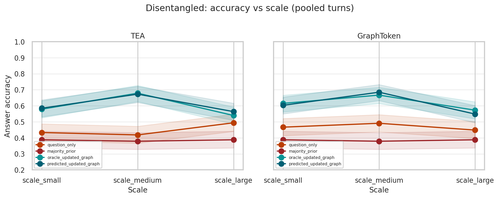

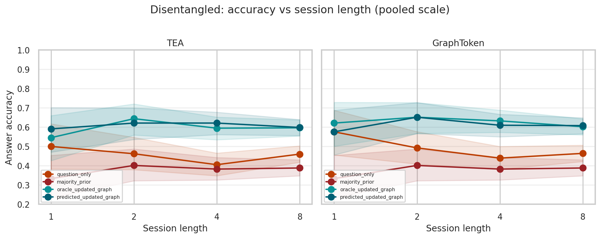

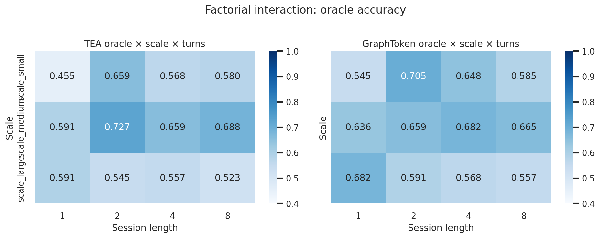

- **Scale** is the clearer hardness axis (large ≪ medium).  
- **Length alone** does not explain the old OOD drop once crossed with small/medium graphs.  
- Absolute oracle (~60%) is lower than the entangled CF headline (~70%) because the mix is harder and more balanced — not because checkpoints changed.  
- CLEGR-style strata (task, density, answer-changing, cells, paired Δ): [`results/v2_gate_variant_cf_factorial-20260909/`](results/v2_gate_variant_cf_factorial-20260909/).

Full write-up: [`results/v2_gate_variant_cf_factorial-20260909/report.md`](results/v2_gate_variant_cf_factorial-20260909/report.md).

---

## 1. Executive summary

On the **original** gate-variant CF diagnostic slice (entangled OOD), the dynamic-update hypothesis holds for both architectures:

| Claim | Result |
|---|---|
| Static oracle-QA gate (≥70%, no task &lt;50%) | TEA **77.4%** pass; GraphToken **77.1%** pass; soft-prompt **48.9%** fail (expected) |
| Re-encode after update beats text / stale baselines | Oracle ~**70–71%** vs question_only ~**47%**, majority_prior ~**38%**, soft_prompt ~**53%** |
| Full GraphModi pipeline (`predicted_updated_graph`) | TEA **69.0%**, GraphToken **69.4%**; edit-exec accuracy **96.4%** |
| Oracle − GraphModi gap | **1.2pp / 1.8pp** — mostly batched bf16 noise, not edit failure |
| Multimodal gain (oracle − max(soft_prompt, structure_only)) | **+16.7pp (TEA)** / **+17.7pp (GraphToken)** |

**Complexity trends on the entangled CF set:** accuracy falls as graphs get larger and sessions get longer — but those axes were coupled in OOD (see §0 for the corrected factorial reading).

**Claim boundary:** this is a narrowed three-task yes/no diagnostic, not a full CLEGR-style mix. Numeric / path tasks remain outside the gate.

---

## 2. Problem and hypotheses

Graph-Modi tests whether a frozen LLM with a trained graph adapter can:

1. **Parse** a natural-language revision into an executable edit program.
2. **Apply** that program to the current attributed metro graph.
3. **Re-encode** \(G_t\) and answer \(Q_t\) from the updated graph prefix (not from stale \(G_0\) + text history alone).

**Primary hypothesis (dynamic update):**  
`oracle_updated_graph` / `predicted_updated_graph` ≫ `frozen_graph_history`, `graph_once_then_text`, `cached_no_reencode`, and text-only baselines.

**Architecture comparison:** TEA-GLM-style (freeze GNN after pretrain; train projector) vs GraphToken-style (joint GNN+projector, warm-started from the same GNN checkpoint), matched LLM, GraphSAGE encoder, and **10** graph-prefix tokens.

**Admission test:** a soft-prompt model (learned \(10 \times d\) prompt, **no** GNN / topology) trained on the same corpus should fail the static gate and underperform full GLMs on dynamic eval.

---

## 3. Dataset design

### 3.1 Distribution and task mix

- **Distribution:** `metro_v2_preliminary` — fictional attributed Watts–Strogatz metro graphs (lines, stations, travel attributes).
- **Tasks (static + dynamic):** `edge_exists`, `reachability`, `cycle_membership` only.  
  These are the yes/no reasoning types that clear the static capability gate. Harder numeric/path tasks (`shortest_path`, `path_cost`, `filtered_*`) are excluded from this diagnostic corpus by design.
- **Gold answers:** deterministic symbolic solvers (`tool_solver` ceiling = 100%).

### 3.2 Static corpus and counterfactual training

| Split | Graphs / tuples |
|---|---|
| Static train | 2000 graphs → **15,992** tuples |
| Static validation | 250 graphs → **2,250** tuples |
| Static test | 500 graphs → **4,500** tuples |
| Tuples per graph | 9 |

**Counterfactual static train** (`counterfactual_static_train: true`): training tuples are before/after-one-edit pairs on the **same** entities, so the projector must track state change—not only read i.i.d. fresh graphs. Static validation/test remain i.i.d. (gate still measures base graph-reading).

### 3.3 Dynamic sessions

| Split | Sessions | Turns | Session lengths | Scale |
|---|---|---|---|---|
| Validation | 150 | 350 | 1 / 2 / 4 (balanced) | ID: `scale_small` ≤24, `scale_medium` 25–39 |
| Test | 350 | 815 | 1 / 2 / 4 | ID |
| OOD | 250 | 2000 | **8 only** | `scale_ood` ≥40 |

**Total dynamic turns evaluated:** 3165 per condition.

**Important confound:** OOD is simultaneously longer sessions (8 turns) and larger graphs (`scale_ood`). Length and scale are not independently crossed.

### 3.4 Complexity metadata (per turn)

Each turn carries `Turn.complexity` from generation (`src/graph_modi/data/v2.py`):

| Axis | Bins | Notes |
|---|---|---|
| `scale_bin` | `scale_small`, `scale_medium`, `scale_ood` | OOD flag forces `scale_ood` |
| `density` | `sparse` (&lt;0.08), `medium` (&lt;0.18), `dense` | **This run has no sparse turns** (only medium/dense) |
| `edit_count` | 1 / 2 / 3 | Ops in the gold edit program for that turn |
| Session length | 1 / 2 / 4 / 8 | ID vs OOD as above |

### 3.5 Edits and utterances

- Edit ops: `ADD`, `DEL`, `SET`, `NOOP` (~15–20% NOOP by design).
- Turns can require **0–3** edits; models emit `;`-separated programs terminated by `END`.
- Scoring uses execution-equivalent full programs (not first edit only).

### 3.6 Audit snapshot

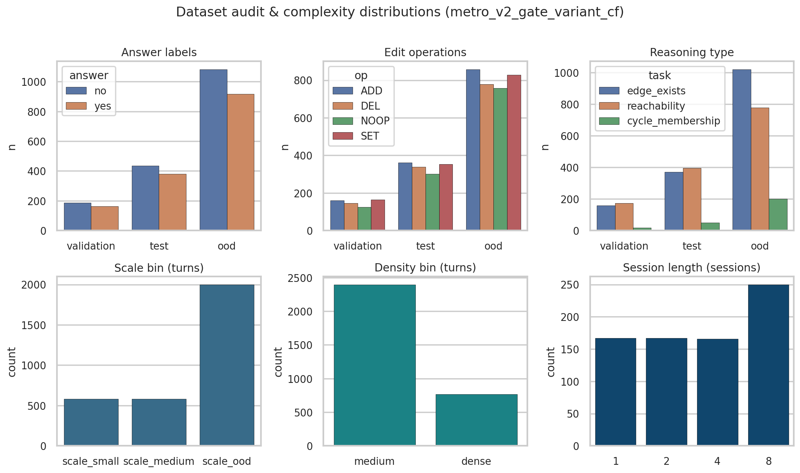

| Split | Sessions | Turns | NOOP turns | CF pairs | Majority prior | Valid |
|---|---|---|---|---|---|---|
| Validation | 150 | 350 | 125 | 225 | 53.4% | yes |
| Test | 350 | 815 | 301 | 514 | 53.3% | yes |
| OOD | 250 | 2000 | 758 | 1242 | 54.2% | yes |

Reasoning mix (all dynamic turns): `edge_exists` 1549, `reachability` 1348, `cycle_membership` 268.

---

## 4. Experimental setup

### 4.1 Shared backbone

| Setting | Value |
|---|---|
| LLM | Meta-Llama-3.1-8B-Instruct, bf16, frozen |
| Graph encoder | GraphSAGE, hidden 4096, 8 layers, sum aggregation |
| Prefix tokens | 10 |
| Node features | 12-d |
| Seed | 42 |
| Eval batch size | 96 |
| Max new tokens | 32 |
| Eval splits | validation, test, ood |

### 4.2 Models

| Model | Training | Role |
|---|---|---|
| **TEA** | Pretrain GNN 20 epochs (lr 2e-3, bs 64); freeze GNN; train 1-layer query-conditioned projector 5 epochs (lr 5e-4, bs 24) | Primary GLM |
| **GraphToken** | Warm-start from TEA GNN; joint GNN+projector 5 epochs (lr 5e-4, bs 24) | Architecture compare |
| **soft_prompt** | No GNN; learn \(10 \times d\) soft prompt 5 epochs (lr 1e-3, bs 24); same CF corpus | Text-only admission baseline |

### 4.3 Evaluation conditions

| Condition | Meaning |
|---|---|
| `oracle_updated_graph` | Gold edits applied; re-encode \(G_t\) |
| `predicted_updated_graph` | Model-predicted edits applied; re-encode (GraphModi) |
| `frozen_graph_history` | Stale \(G_0\) tokens + text history |
| `graph_once_then_text` / `cached_no_reencode` | No per-turn re-encode |
| `question_only` / `majority_prior` | Text / label baselines |
| `soft_prompt` | Separate checkpoint, no topology |
| `structure_only` / `shuffled_graph` | Topology ablations |
| `serialized_*` / `modify_and_print` / `token_matched_history` | Text-graph / history controls |
| `tool_solver` | Symbolic ceiling |

---

## 5. Static gate

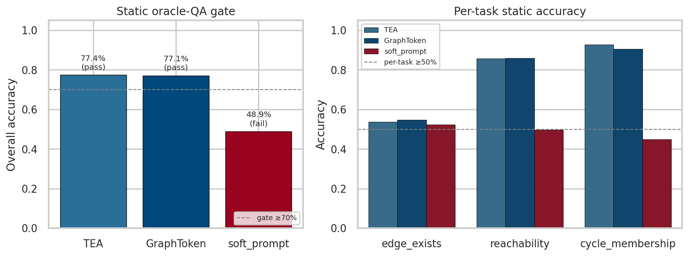

| | TEA | GraphToken | soft_prompt |
|---|---|---|---|
| Overall accuracy | **77.4%** | **77.1%** | 48.9% |
| Gate (≥70%, no task &lt;50%) | Pass | Pass | **Fail** (`cycle_membership`, `reachability`) |
| `edge_exists` | 53.7% | 54.8% | 52.3% |
| `reachability` | 85.7% | 86.0% | 49.7% |
| `cycle_membership` | 92.8% | 90.5% | 44.8% |

Soft-prompt failure is the intended admission result: the static gate requires graph grounding, not question text alone.

---

## 6. Main dynamic results

### 6.1 Turn-weighted overall (n=3165 turns/condition)

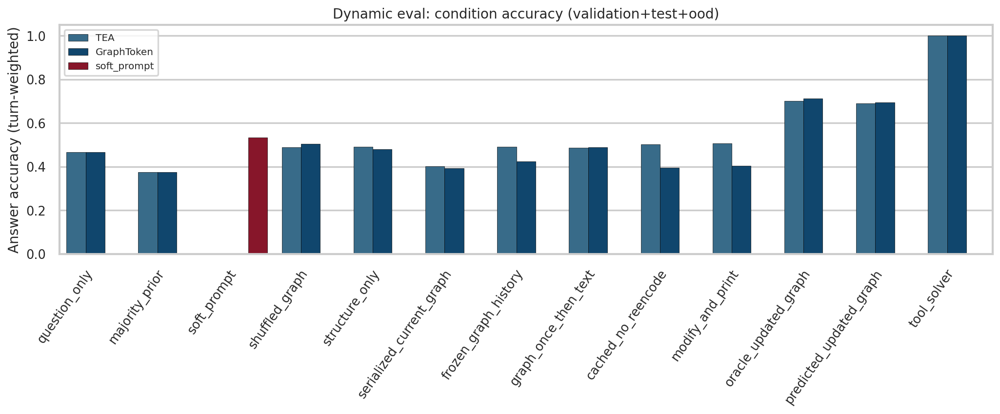

| Condition | TEA | GraphToken |
|---|---|---|
| `question_only` | 46.8% | 46.8% |
| `majority_prior` | 37.6% | 37.6% |
| `soft_prompt` (own checkpoint) | 53.5% | 53.5% |
| `shuffled_graph` | 49.0% | 50.5% |
| `structure_only` | 49.3% | 48.1% |
| `serialized_current_graph` | 40.3% | 39.2% |
| `frozen_graph_history` | 49.2% | 42.5% |
| `graph_once_then_text` | 48.6% | 48.9% |
| `cached_no_reencode` | 50.3% | 39.6% |
| `modify_and_print` | 50.6% | 40.4% |
| **`oracle_updated_graph`** | **70.1%** | **71.2%** |
| **`predicted_updated_graph`** | **69.0%** | **69.4%** |
| `tool_solver` | 100.0% | 100.0% |
| **Edit-prediction accuracy** | **96.4%** | **96.4%** |

### 6.2 Per-split heatmap (key conditions)

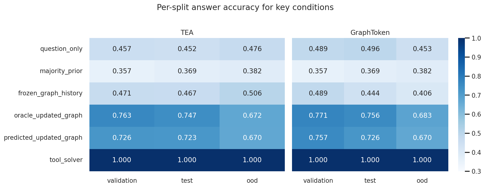

Oracle / predicted stay well above question-only and majority baselines on validation and test, and remain ahead on OOD while absolute accuracy drops (~76–77% → ~67–68% for oracle). Full CI tables are in the appendix.

**soft_prompt by split:** val 52.9%, test 49.7%, ood 55.1%.

---

## 7. Complexity trends

Primary analysis: how answer accuracy changes with **scale**, **density**, and **session length / turn index**. Shown for `oracle_updated_graph`, `predicted_updated_graph`, `question_only`, and `majority_prior`.

### 7.1 Graph scale

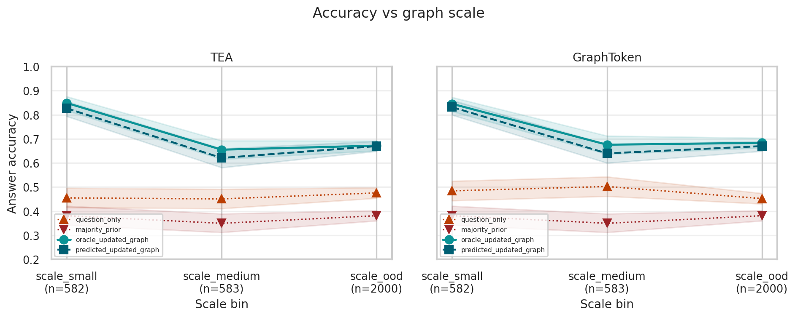

| Condition | scale_small (n=582) | scale_medium (n=583) | scale_ood (n=2000) |
|---|---|---|---|
| `question_only` | TEA 0.455 / GT 0.485 | TEA 0.451 / GT 0.503 | TEA 0.476 / GT 0.453 |
| `majority_prior` | TEA 0.381 / GT 0.381 | TEA 0.350 / GT 0.350 | TEA 0.382 / GT 0.382 |
| `oracle_updated_graph` | **TEA 0.849 / GT 0.845** | TEA 0.655 / GT 0.676 | TEA 0.672 / GT 0.683 |
| `predicted_updated_graph` | TEA 0.826 / GT 0.832 | TEA 0.621 / GT 0.640 | TEA 0.670 / GT 0.670 |

Accuracy is highest on small graphs and drops sharply into medium/OOD. Oracle and predicted stay close at every scale (gap no longer opens at large graphs).

### 7.2 Graph density

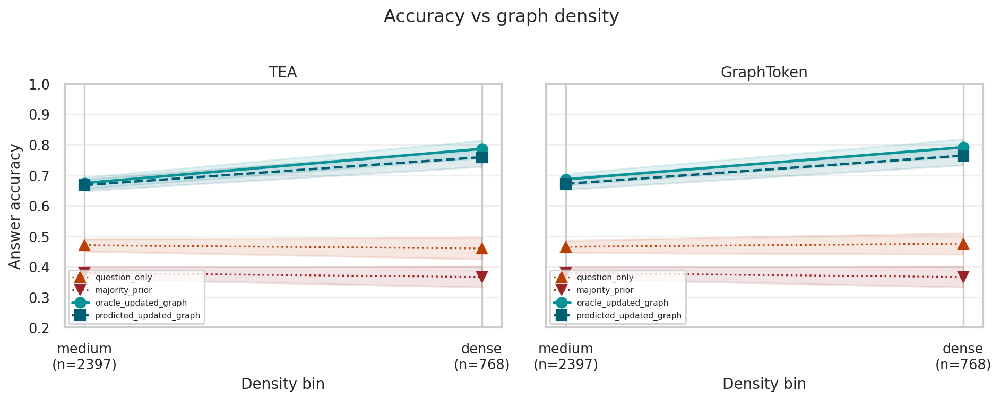

| Condition | medium (n=2397) | dense (n=768) |
|---|---|---|
| `question_only` | TEA 0.470 / GT 0.465 | TEA 0.460 / GT 0.475 |
| `majority_prior` | TEA 0.379 / GT 0.379 | TEA 0.366 / GT 0.366 |
| `oracle_updated_graph` | TEA 0.674 / GT 0.686 | **TEA 0.786 / GT 0.792** |
| `predicted_updated_graph` | TEA 0.668 / GT 0.672 | TEA 0.759 / GT 0.764 |

Dense &gt; medium for oracle/predicted. Part of this is a **reasoning-type confound**: `cycle_membership` (easy majority baseline 94%) is over-represented in dense turns. No `sparse` turns were generated in this corpus.

### 7.3 Session length

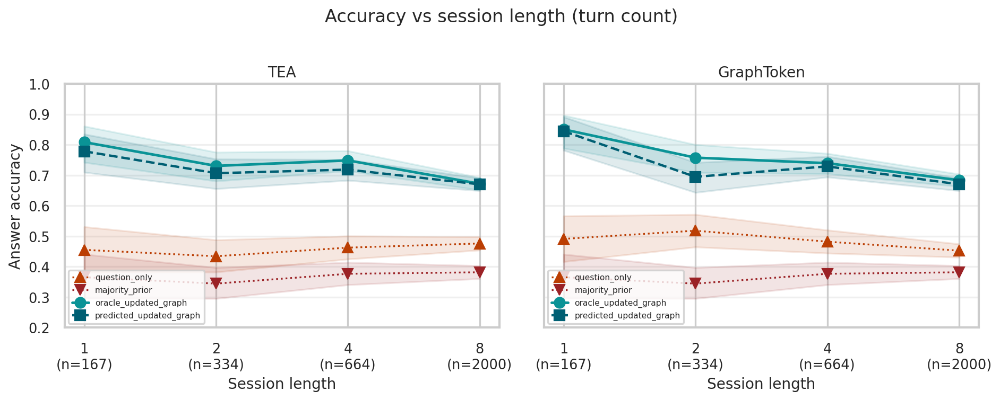

| Condition | 1 (n=167) | 2 (n=334) | 4 (n=664) | 8 (n=2000) |
|---|---|---|---|---|
| `question_only` | TEA 0.455 / GT 0.491 | TEA 0.434 / GT 0.518 | TEA 0.462 / GT 0.482 | TEA 0.476 / GT 0.453 |
| `majority_prior` | TEA 0.365 / GT 0.365 | TEA 0.344 / GT 0.344 | TEA 0.377 / GT 0.377 | TEA 0.382 / GT 0.382 |
| `oracle_updated_graph` | **TEA 0.808 / GT 0.850** | TEA 0.731 / GT 0.757 | TEA 0.748 / GT 0.739 | TEA 0.672 / GT 0.683 |
| `predicted_updated_graph` | TEA 0.778 / GT 0.844 | TEA 0.707 / GT 0.695 | TEA 0.718 / GT 0.729 | TEA 0.670 / GT 0.670 |

Both oracle and predicted degrade as sessions lengthen, staying aligned. Length-8 is exactly the OOD-scale split, so “longer” and “bigger” are entangled.

### 7.4 Turn index (within session)

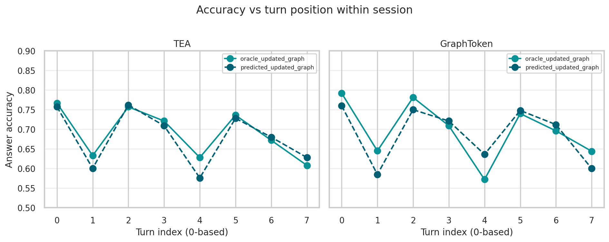

| turn_index | 0 | 1 | 2 | 3 | 4 | 5 | 6 | 7 |
|---|---|---|---|---|---|---|---|---|
| TEA `oracle_updated_graph` | 0.767 | 0.633 | 0.757 | 0.721 | 0.628 | 0.736 | 0.672 | 0.608 |
| TEA `predicted_updated_graph` | 0.757 | 0.600 | 0.762 | 0.709 | 0.576 | 0.728 | 0.680 | 0.628 |
| GT `oracle_updated_graph` | 0.792 | 0.645 | 0.781 | 0.709 | 0.572 | 0.740 | 0.696 | 0.644 |
| GT `predicted_updated_graph` | 0.760 | 0.585 | 0.750 | 0.721 | 0.636 | 0.748 | 0.712 | 0.600 |

Accuracy **oscillates** (dips at turns 1 and 4) rather than decaying smoothly. Pattern is shared by both architectures and by oracle vs predicted—likely a generation-schedule artifact (reasoning/edit cycling by turn position), not session-length fatigue alone.

---

## 8. Fine-grained diagnostics

### 8.1 Reasoning type

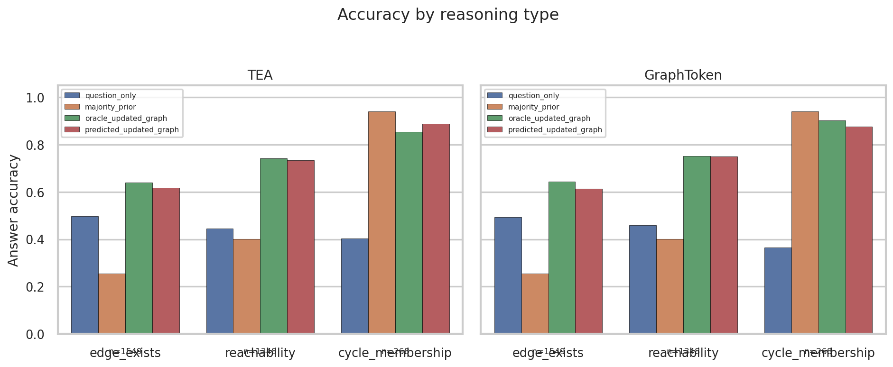

| Condition | edge_exists (n=1549) | reachability (n=1348) | cycle_membership (n=268) |
|---|---|---|---|
| `question_only` | TEA 0.498 / GT 0.493 | TEA 0.445 / GT 0.458 | TEA 0.403 / GT 0.366 |
| `majority_prior` | TEA 0.255 / GT 0.255 | TEA 0.402 / GT 0.402 | **TEA 0.940 / GT 0.940** |
| `oracle_updated_graph` | TEA 0.639 / GT 0.644 | TEA 0.743 / GT 0.752 | TEA 0.854 / GT 0.903 |
| `predicted_updated_graph` | TEA 0.617 / GT 0.614 | TEA 0.734 / GT 0.750 | TEA 0.888 / GT 0.877 |

Unambiguous state-tracking evidence is in `edge_exists` (majority 25.5%, oracle +38–39pp) and `reachability` (majority 40.2%, oracle +34–35pp). High `cycle_membership` absolute accuracy is weak evidence given the 94% majority baseline.

### 8.2 Answer-changing turns

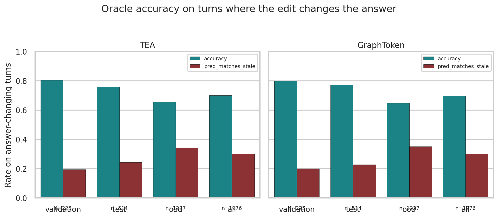

Restricted to turns where `gold_answer ≠ stale_answer` (~62% of turns):

| | TEA | GraphToken |
|---|---|---|
| **All (n=1976)** | **70.0%** acc, 30.0% pred-matches-stale | **69.8%** acc, 30.2% stale-match |
| Validation (n=225) | 80.4% / 19.6% | 80.0% / 20.0% |
| Test (n=514) | 75.7% / 24.3% | 77.2% / 22.8% |
| OOD (n=1237) | 65.7% / 34.3% | 64.8% / 35.2% |

This is the core state-tracking diagnostic: the model must not answer the pre-edit label.

### 8.3 Edit prediction by operation count

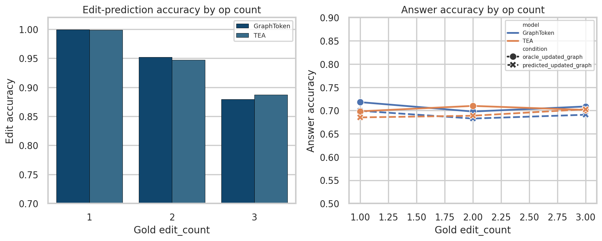

| edit_count | n | Edit accuracy | Answer accuracy (predicted) |
|---|---|---|---|
| 1 | 1830 | TEA ~99.9% / GT ~100% | TEA 68.5% / GT 69.9% |
| 2 | 662 | TEA **94.7%** / GT **95.2%** | TEA 68.9% / GT 68.3% |
| 3 | 673 | TEA **88.7%** / GT **88.0%** | TEA 70.3% / GT 69.1% |

Multi-op turns remain harder for edit parsing, but answer accuracy stays stable—edit errors are rare enough (~3.6% of turns) not to dominate the headline gap.

### 8.4 Oracle vs predicted residual

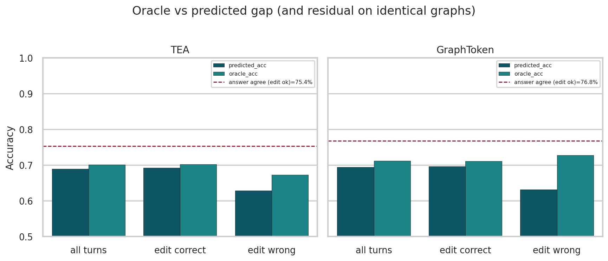

| Slice | TEA | GraphToken |
|---|---|---|
| Edit correct (n≈3052 / 3051, 96.4%) | pred 69.2% vs oracle 70.2% on same turns | pred 69.6% vs oracle 71.1% |
| Edit wrong (n≈113 / 114) | pred 62.8% | pred 63.2% |
| Answer agreement on edit-correct turns | **75.4%** | **76.8%** |

Wrong edits explain only ~0.3pp of the coarse gap. Most of the residual gap remains even when the resulting graph is byte-identical—consistent with batched bf16 non-determinism across separately batched conditions. Treat oracle and GraphModi as near-equivalent for capability claims.

---

## 9. Derived metrics

| Metric | TEA | GraphToken |
|---|---|---|
| Oracle − GraphModi gap | 1.2pp | 1.8pp |
| Multimodal gain: oracle − max(`soft_prompt` 53.5%, `structure_only`) | **+16.7pp** | **+17.7pp** |
| Oracle − `question_only` | +23.4pp | +24.4pp |
| Oracle − `majority_prior` | +32.6pp | +33.6pp |

**Note:** multimodal gain compares three trained models (TEA / GraphToken / soft-prompt), not three toggles of one model—soft-prompt has no topology channel under any condition.

---

## 10. Limitations and claim boundary

1. **Narrowed task mix** — three yes/no tasks only; not a full-benchmark claim.
2. **`cycle_membership` class imbalance** (94% majority) inflates dense-bucket scores.
3. **No sparse-density turns** in this generation.
4. **OOD confound (original CF dynamic set)** — 8-turn sessions ≡ large-graph OOD; length vs scale not separable there. **Addressed** by the factorial eval in §0 (`metro_v2_gate_variant_cf_factorial`).
5. **Turn-index oscillation** unexplained; likely generation schedule artifact.
6. **Residual oracle–predicted gap** dominated by batched bf16 decoding noise.
7. Soft-prompt is a **separate architecture**, not a condition ablation on TEA/GraphToken.

---

## 11. Appendix

### 11.1 Figure index

| File | Content |
|---|---|
| [`figures/dataset_audit.png`](figures/dataset_audit.png) | Label / op / reasoning / complexity distributions |
| [`figures/static_gate.png`](figures/static_gate.png) | Static overall + per-task |
| [`figures/conditions_overall.png`](figures/conditions_overall.png) | All conditions, turn-weighted |
| [`figures/conditions_by_split.png`](figures/conditions_by_split.png) | Key conditions × split heatmaps |
| [`figures/trend_scale.png`](figures/trend_scale.png) | Accuracy vs scale |
| [`figures/trend_density.png`](figures/trend_density.png) | Accuracy vs density |
| [`figures/trend_session_length.png`](figures/trend_session_length.png) | Accuracy vs session length |
| [`figures/trend_turn_index.png`](figures/trend_turn_index.png) | Accuracy vs turn position |
| [`figures/reasoning_type.png`](figures/reasoning_type.png) | By task type |
| [`figures/edit_ops.png`](figures/edit_ops.png) | Edit + answer accuracy by op count |
| [`figures/answer_changing.png`](figures/answer_changing.png) | Answer-changing diagnostic |
| [`figures/oracle_vs_predicted_gap.png`](figures/oracle_vs_predicted_gap.png) | Residual gap analysis |

### 11.2 Per-split answer accuracy [Wilson 95% CI]

**TEA** (predicted edit_acc: val 0.929, test 0.945, ood 0.979)

| Condition | Validation (n=350) | Test (n=815) | OOD (n=2000) |
|---|---|---|---|
| `question_only` | 0.457 [0.406,0.510] | 0.452 [0.418,0.486] | 0.476 [0.454,0.498] |
| `frozen_graph_history` | 0.471 [0.420,0.524] | 0.467 [0.433,0.502] | 0.506 [0.484,0.528] |
| `graph_once_then_text` | 0.497 [0.445,0.549] | 0.491 [0.457,0.525] | 0.482 [0.460,0.504] |
| `shuffled_graph` | 0.503 [0.451,0.555] | 0.469 [0.435,0.503] | 0.496 [0.474,0.518] |
| **`oracle_updated_graph`** | **0.763** [0.716,0.804] | **0.747** [0.716,0.776] | **0.672** [0.651,0.692] |
| `cached_no_reencode` | 0.514 [0.462,0.566] | 0.472 [0.438,0.507] | 0.513 [0.491,0.535] |
| **`predicted_updated_graph`** | **0.726** [0.677,0.770] | **0.723** [0.691,0.752] | **0.670** [0.649,0.690] |
| `serialized_initial_history` | 0.443 [0.392,0.495] | 0.466 [0.432,0.501] | 0.478 [0.457,0.500] |
| `token_matched_history` | 0.554 [0.502,0.605] | 0.537 [0.503,0.571] | 0.498 [0.477,0.520] |
| `serialized_current_graph` | 0.389 [0.339,0.441] | 0.400 [0.367,0.434] | 0.407 [0.386,0.429] |
| `structure_only` | 0.489 [0.437,0.541] | 0.476 [0.442,0.510] | 0.500 [0.478,0.522] |
| `modify_and_print` | 0.503 [0.451,0.555] | 0.477 [0.443,0.512] | 0.518 [0.497,0.540] |
| `majority_prior` | 0.357 [0.309,0.409] | 0.369 [0.337,0.403] | 0.382 [0.360,0.403] |
| `tool_solver` | 1.000 [0.989,1.000] | 1.000 [0.995,1.000] | 1.000 [0.998,1.000] |

**GraphToken** (predicted edit_acc: val 0.923, test 0.950, ood 0.977)

| Condition | Validation (n=350) | Test (n=815) | OOD (n=2000) |
|---|---|---|---|
| `question_only` | 0.489 [0.437,0.541] | 0.496 [0.461,0.530] | 0.453 [0.431,0.474] |
| `frozen_graph_history` | 0.489 [0.437,0.541] | 0.444 [0.410,0.478] | 0.406 [0.385,0.428] |
| `graph_once_then_text` | 0.511 [0.459,0.563] | 0.494 [0.460,0.529] | 0.483 [0.461,0.505] |
| `shuffled_graph` | 0.486 [0.434,0.538] | 0.476 [0.442,0.510] | 0.520 [0.498,0.542] |
| **`oracle_updated_graph`** | **0.771** [0.725,0.812] | **0.756** [0.725,0.784] | **0.683** [0.663,0.704] |
| `cached_no_reencode` | 0.466 [0.414,0.518] | 0.447 [0.413,0.481] | 0.362 [0.342,0.384] |
| **`predicted_updated_graph`** | **0.757** [0.710,0.799] | **0.726** [0.695,0.756] | **0.670** [0.649,0.690] |
| `serialized_initial_history` | 0.380 [0.331,0.432] | 0.464 [0.430,0.498] | 0.489 [0.468,0.511] |
| `token_matched_history` | 0.537 [0.485,0.589] | 0.517 [0.482,0.551] | 0.507 [0.485,0.529] |
| `serialized_current_graph` | 0.411 [0.361,0.464] | 0.393 [0.360,0.427] | 0.389 [0.368,0.411] |
| `structure_only` | 0.489 [0.437,0.541] | 0.459 [0.425,0.493] | 0.489 [0.467,0.511] |
| `modify_and_print` | 0.417 [0.367,0.469] | 0.382 [0.349,0.415] | 0.411 [0.390,0.433] |
| `majority_prior` | 0.357 [0.309,0.409] | 0.369 [0.337,0.403] | 0.382 [0.360,0.403] |
| `tool_solver` | 1.000 [0.989,1.000] | 1.000 [0.995,1.000] | 1.000 [0.998,1.000] |

**soft_prompt**

| Split | Accuracy [95% CI] |
|---|---|
| Validation (n=350) | 0.529 [0.476,0.580] |
| Test (n=815) | 0.497 [0.463,0.531] |
| OOD (n=2000) | 0.551 [0.530,0.573] |

### 11.3 Artifact paths

| Artifact | Path |
|---|---|
| Dataset | `datasets/metro_v2_gate_variant_cf/` |
| TEA eval / static | `outputs/v2_gate_variant_cf_tea/{evaluation,static_eval_validation}.json` |
| GraphToken eval / static | `outputs/v2_gate_variant_cf_graphtoken/{evaluation,static_eval_validation}.json` |
| soft_prompt eval / static | `outputs/v2_gate_variant_cf_soft_prompt/{evaluation,static_eval_validation}.json` |
| Pipeline logs | `documents/experiments/gate_variant_cf_run_logs/` |
| Figure script | `scripts/plot_v2_cf_status_report.py` |

Regenerate figures:

```bash
/home/arihantr/ANLP/.venv/bin/python scripts/plot_v2_cf_status_report.py
```
