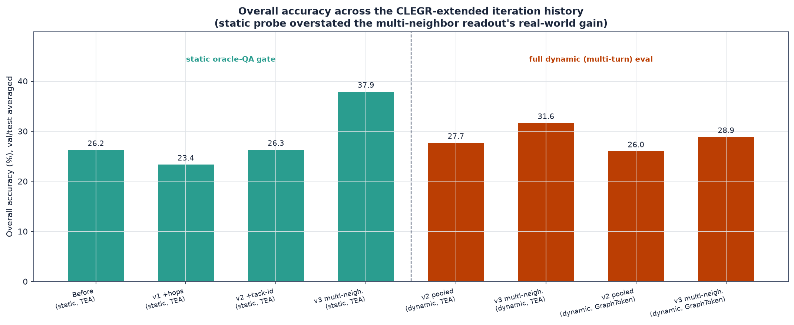
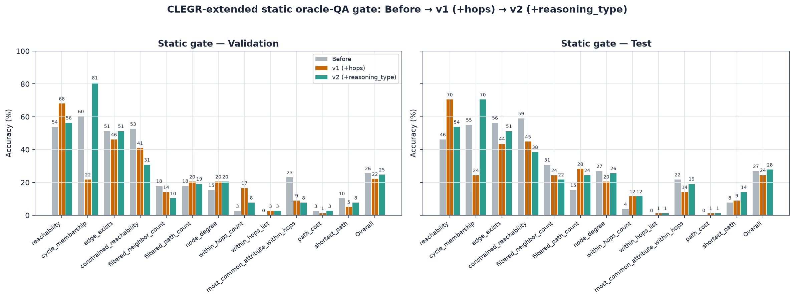
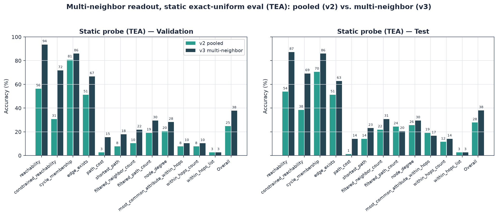
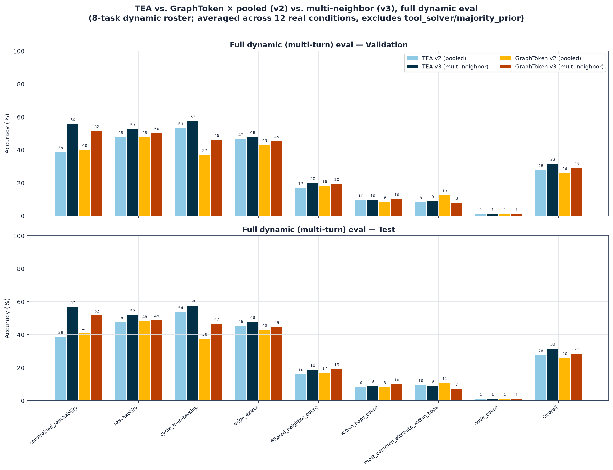
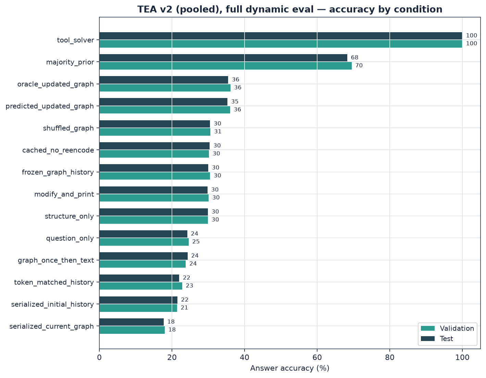

# CLEGR-Extended Task Family: Status Report (exploratory, in progress)

**Status:** TEA-GLM and GraphToken both iterated to v2 (hops + reasoning_type); multi-neighbor
readout (v3) prototyped, validated on static eval, extended to GraphToken, and run through the
**full 4-way dynamic (multi-turn) eval matrix** (TEA/GraphToken × pooled/multi-neighbor) — see
§7 for the headline result. soft_prompt not part of the v2/v3 comparison.
**Branch:** `exact2x`
**Config family:** [`configs/v2_clegr_extended_*.yaml`](../../../../configs/) (train) and
[`configs/v2_clegr_extended_exact2x_*.yaml`](../../../../configs/) (eval-only, exact-uniform)
**Compute:** remote GPU box (10.4.25.56), GPU 1 only, shared with another user's job —
GPU 0 and GPU 1's pre-existing allocation were never touched.
**Artifacts in this folder:** `static_eval_{validation,test}.json` (TEA v2 checkpoint),
`gnn_metadata.json`, `projector_metadata.json`, `train_dataset_audit.json`,
`exact2x_dataset_audit.json`, `multi_neighbor_static_eval_{validation,test}.json` (TEA v3).
**Figures:** [`figures/clegr_extended_*.png`](../../figures/) (`scripts/analyze_clegr_extended.py`)

---

## Figure gallery

---

## 1. Motivation

The existing benchmark (`v2_gate_variant_cf_exact2x`, see
[`../v2_gate_variant_cf_exact2x-20260911/report.md`](../v2_gate_variant_cf_exact2x-20260911/report.md))
narrows the task mix to three yes/no, topology-only tasks (`edge_exists`, `reachability`,
`cycle_membership`) — explicitly flagged there as limitation #1: "not a full-benchmark claim."
This work extends the task family toward CLEGR (arXiv 2508.20583, *A Graph Talks, But Who's
Listening? Rethinking Evaluations for Graph-Language Models*, Findings ACL 2026) — the paper
[`README.md`](../../../../README.md) already cites as the design basis — by adding filtered
aggregation, weighted path cost, constrained reachability, and topology-with-filter task
families, and applying the same exact-uniform balancing already used for dynamic val/test to
the static oracle-QA corpus too.

## 2. What was implemented

### 2.1 New task families (code)

Four new `ReasoningType` members added end-to-end (schema → solver → question rendering →
candidate generation → hop-depth stratification → task rosters):
[`schema.py`](../../../../src/graph_modi/schema.py),
[`graph/solvers.py`](../../../../src/graph_modi/graph/solvers.py),
[`data/multiturn.py`](../../../../src/graph_modi/data/multiturn.py),
[`data/v2.py`](../../../../src/graph_modi/data/v2.py):

- `constrained_reachability` — reachability while avoiding a class of station (fixed to
  `accessible == False`, deliberately narrowed from an original 5-filter design per a later
  "keep tasks easier" pass).
- `within_hops_count` — count of stations within a fixed hop radius (2), optionally filtered
  by attribute.
- `within_hops_list` — comma-separated list of stations within hops matching a filter
  (filtered-only, not "list everyone nearby," to keep answers short).
- `most_common_attribute_within_hops` — modal attribute value among stations within hops.

Also activated three task types that already had solver logic but were never wired into any
active task roster (`filtered_neighbor_count`, `filtered_path_count`, `path_cost`), and fixed
two real bugs found along the way:

- `node_degree` was listed in `_STATIC_TASKS` but had no `_queries()` candidate-generation
  branch, so it silently produced zero training examples every time (`generate_static_corpus`
  skips a task with no candidates rather than erroring). Fixed by adding the missing branch.
- Watts-Strogatz edges always kept the schema default `weight=1.0`, making `path_cost`
  numerically degenerate (cost == hop count). Fixed by assigning the same `[1,5]` weight range
  SBM/Erdos-Renyi already use, as a final pass in `make_graph`.

### 2.2 Metrics

[`evaluation/metrics.py`](../../../../src/graph_modi/evaluation/metrics.py) gained
`answers_match()` (numeric tolerance for `path_cost`-style answers instead of blind string
equality) and `set_f1()` (set-valued scoring for `within_hops_list`), wired into both
`evaluation/runner.py` and `evaluation/static_eval.py`.

### 2.3 Exact-uniform balancing extended to static data

`generate_static_exact_uniform()` in `data/v2.py` mirrors `generate_exact_uniform_sessions()`
(same exact-`n` x density grid, now crossed with the expanded task list) but for independent
static `(G, Q, A)` tuples instead of dynamic sessions. Wired through a new
`data.static_layout: exact_uniform` / `data.static_exact_uniform` config block in
[`cli.py`](../../../../src/graph_modi/cli.py) — train split stays free-sampled, matching how
`generate_exact_uniform_sessions` already treats train.

### 2.4 New configs

`v2_clegr_extended_{tea,graphtoken,soft_prompt}.yaml` (train, free-sampled data, expanded task
lists) and `v2_clegr_extended_exact2x_{tea,graphtoken,soft_prompt}.yaml` (eval-only,
exact-uniform static + dynamic) — new files, none of the historical `v2_gate_variant_cf_*`
configs were touched, so existing results/checkpoints remain reproducible as before.

## 3. Infrastructure

Remote GPU box provisioned from scratch this session: `uv` venv (torch 2.13 / CUDA 13),
`meta-llama/Meta-Llama-3.1-8B-Instruct` downloaded (~16GB) after working around an IPv6
black-hole on that network (forced IPv4-only resolution in the download script — see
git history for the exact monkeypatch). GPU 1 is shared with another user's job whose memory
footprint fluctuated between ~34GB and ~53GB over the session; never touched, only the
remaining free slice was used.

## 4. Training/eval iteration history

Three static oracle-QA gate runs against `configs/v2_clegr_extended_exact2x_tea.yaml`
(same eval-only exact-uniform dataset each time; TEA only — GraphToken/soft_prompt not yet
retrained on the fixed architecture). All three **fail** the 70%-overall / no-task-below-50%
gate; the point of tracking them is the *shape* of the failure, not a pass.

| Run | Config delta from previous | Overall (val/test) |
|---|---|---|
| **Before** | Initial full task-family expansion: 12-dim hashed node features, 5 projector epochs, 20 GNN-pretrain epochs, `max_new_tokens=32`, `batch_size=24` | 25.6% / 26.9% |
| **v1 (+hops)** | `node_feature_size` 12→64, projector epochs 5→10, GNN-pretrain epochs 20→30, `max_new_tokens` 32→96 (fixed answer truncation), `batch_size` 24→8 + `gradient_accumulation_steps` 1→3 (CUDA OOM workaround — GPU-neighbor memory grew mid-run), hop radius threaded into the graph encoder as `HOPS_FEATURE_DIM` | 22.2% / 24.5% |
| **v2 (+reasoning_type)** | One-hot task-identity feature (`REASONING_TYPE_FEATURE_DIM`) added alongside hops; task difficulty also reduced (hop radius fixed at 2, `within_hops_list` filtered-only, `constrained_reachability` single-filter) | **24.8% / 27.8%** |

Full per-task breakdown (validation / test, percent):

| Task | Before | v1 (+hops) | v2 (+task-id) |
|---|---|---|---|
| reachability | 53.9 / 46.2 | 68.0 / 70.5 | 56.4 / 53.8 |
| **cycle_membership** | 60.3 / 55.1 | **21.8 / 24.4** | **80.8 / 70.5** |
| edge_exists | 51.3 / 56.4 | 46.2 / 43.6 | 51.3 / 51.3 |
| constrained_reachability | 52.6 / 59.0 | 41.0 / 44.9 | 30.8 / 38.5 |
| filtered_neighbor_count | 17.9 / 30.8 | 14.1 / 24.4 | 10.3 / 21.8 |
| filtered_path_count | 17.9 / 15.4 | 20.5 / 28.2 | 19.2 / 24.4 |
| node_degree | 15.4 / 26.9 | 20.5 / 20.5 | 20.5 / 25.6 |
| **within_hops_count** | 2.6 / 3.8 | **16.7 / 11.5** | 7.7 / 11.5 |
| within_hops_list | 0.0 / 0.0 | 2.6 / 1.3 | 2.6 / 1.3 |
| most_common_attribute_within_hops | 23.1 / 21.8 | 9.0 / 14.1 | 7.7 / 19.2 |
| path_cost | 2.6 / 0.0 | 1.3 / 1.3 | 2.6 / 1.3 |
| shortest_path | 10.3 / 7.7 | 5.1 / 9.0 | 7.7 / 14.1 |

### 4.1 Root-cause findings

1. **`max_new_tokens=32` truncated list-valued answers mid-token** (inherited from the
   yes/no-only historical configs). Fixed to 96 in the v1 pass; confirmed via raw
   `within_hops_list` predictions like `"...teststation000010"` cut off mid-ID.
2. **`hops` (radius 2 vs. 3) was never passed to the graph encoder.** `encode_graphs` only
   took `source_ids`/`target_ids`; the model saw only the *final*, `num_layers`-mixed node
   embedding, which conflates every radius up to `num_layers` into one vector. Fixed by
   appending a raw hop-count scalar (`HOPS_FEATURE_DIM`) to the projector's input vector in
   `TEAGLM.encode_graphs`/`graph_prefix`/`forward`/`generate`/`generate_batch`, threaded
   through `training.py` and the `TEAGLMBackend` inference path.
3. **Answer-format leakage across the ~12-task mix, diagnosed via raw predictions**, e.g.
   `cycle_membership` (a yes/no task) answered with a bare number (`"15"`) in 32% of v1 test
   examples, and `most_common_attribute_within_hops` (categorical) answered with entire
   comma-separated station-ID lists. Root cause: the model had no explicit task-identity
   signal — only question text plus a task-agnostic graph prefix — and defaulted to whatever
   answer format was best-represented in the training mix (6+ of 12 tasks are numeric).
   Fixed in v2 by adding a one-hot `reasoning_type` feature
   (`REASONING_TYPE_FEATURE_DIM`, full `ReasoningType` enum, not just the two tasks observed
   to leak) via the same encoder path as the hops fix. Confirmed fixed by re-inspecting raw
   predictions: `cycle_membership` off-format rate dropped from ~40% to ~8%, and its accuracy
   went 21.8%→80.8% (val), 24.4%→70.5% (test) — the single largest swing in the whole
   iteration history.
4. **Not fixed by either change — a different, deeper problem:**
   `most_common_attribute_within_hops` kept leaking `"15"`-style numeric answers at the same
   ~31% rate even with the correct task-identity signal present. This is not format confusion
   (the model now knows which task it is) but a genuine capability gap: computing the *mode*
   of an attribute across a neighborhood requires aggregating multiple neighbor values, and
   the current readout gives the projector only one pooled vector (plus source/target/hop/
   task scalars) — nothing that represents the neighbor attribute distribution itself.
5. **`constrained_reachability` never learned above a majority-guess baseline** in any of the
   three runs (majority-class baseline on this eval slice ≈56%; the model scored 30.8-52.6%
   across runs, i.e. at-or-below chance). Likely the same class of limitation as (4): avoiding
   a class of node while checking reachability needs constrained multi-hop pathfinding, which
   shallow GraphSAGE message passing has no strong inductive bias for. The apparent
   before→v1→v2 downward trend is probably mostly small-sample noise (each retrain
   regenerates the underlying graphs, so the specific 78 test cases differ slightly per run)
   rather than the fixes actively making this task worse.

### 4.2 Literature comparison (see conversation for full sourcing)

- CLEGR itself — Rethinking Evaluations for Graph-Language Models, "A Graph Talks, But Who's
  Listening?" (arXiv:2508.20583) — reports that even its own properly-resourced GLMs (5 seeds,
  real BERT-768 text embeddings, larger GraphSAGE) saturate on fact-retrieval but do **not**
  clearly outperform a graph-blind soft-prompted LLM on CLEGR-Reasoning (filtering/aggregation/
  path/topology) — the paper's central finding, not a gap specific to this implementation. See
  §12 for how this project's dynamic (multi-turn) extension relates to that finding.
- TEA-GLM's own paper reports in-domain supervised node-classification accuracy of ~58-66%
  (Arxiv, Computer) and cross-dataset link-prediction AUC of ~55-69% — simpler, single-step
  tasks, offered here only as a rough scale reference for "what this architecture family
  typically achieves when it's working."
- Our topology-only tasks (`reachability`, `cycle_membership`, `edge_exists`), after the v2
  fix, score 51-81% — in the same range as, and on `cycle_membership` above, TEA-GLM's own
  reported numbers for comparable structural difficulty. The compositional/aggregation tasks
  (0-25%) sit well below that, consistent with CLEGR's own documented field-wide limitation
  rather than an implementation-specific shortfall.

## 5. Current limitations / open items

- GraphToken has since been retrained on the v2 (hops + reasoning_type) architecture and has
  its own multi-neighbor (v3) checkpoint too (see §7) — this bullet is now stale, kept for
  history. soft_prompt is architecturally unaffected by any of this (no graph encoder) and was
  not part of the v2/v3 comparison.
- Full dynamic (multi-turn) evaluation against v2/v3, both architectures, is now running —
  see §7 for status and results as they land. (Previously: "no dynamic eval has been run
  against the v2 checkpoint yet" — also stale.)
- `most_common_attribute_within_hops` and `constrained_reachability` remain near or below a
  naive baseline; closing that gap needs an architecture change, not another metadata feature
  (see below) — deliberately not attempted yet, to avoid iterating on the eval set with
  answer-leaking shortcuts.
- The deferred, larger fix already logged in
  [`../../STATUS_REPORT.md`](../../STATUS_REPORT.md) (task-staged curriculum instead of flat
  round-robin across all 12 tasks from epoch 1) is still outstanding and may be worth
  revisiting if the readout change below doesn't close the gap on its own.

## 6. Proposed next step (exploratory, not yet started)

**Multi-neighbor-token readout.** Instead of collapsing the whole graph into one pooled
vector per query, expose multiple individual (or attribute-grouped) neighbor-node embeddings
as separate graph-prefix tokens, so the frozen LLM can attend over them and do the
counting/mode-finding itself — closer to how multi-token graph-prefix architectures are
generally built, rather than forcing every answer through one vector. This is a legitimate
architectural fix in the same spirit as the `hops`/`reasoning_type` features (exposing
information the query needs, not the computed answer), as opposed to injecting a precomputed
count/histogram feature, which would leak the answer and defeat the point of testing graph
reasoning at all.

**Agreed scope:** prototype this on **TEA only**, as a throwaway exploratory branch/config —
not wired into the main pipeline yet. If it measurably improves the aggregation-heavy tasks
without regressing the topology tasks that already work, extend it to GraphToken, and keep
both the current (pooled) and new (multi-neighbor-token) readout modes available/configurable
on both architectures rather than replacing one with the other outright.

### 6.1 Result: strongly positive, promoting to real implementation

Implemented as `src/graph_modi/models/multi_neighbor_readout.py` +
`scripts/explore_multi_neighbor_readout.py` (throwaway harness): reuses the v2 TEA
checkpoint's frozen GNN/LM/summary-projector verbatim, trains only a new
`NeighborTokenProjector` (3 epochs) that emits one graph-prefix token per 1-hop neighbor of
the query's source node (zero-padded/truncated to 8 slots), concatenated after the existing
summary tokens. Evaluated on the same static exact-uniform validation/test sets as the v2
baseline:

| Task | v2 (pooled) val/test | Multi-neighbor val/test | Delta |
|---|---|---|---|
| reachability | 56.4 / 53.8 | 93.6 / 87.2 | +37.2 / +33.4 |
| constrained_reachability | 30.8 / 38.5 | 71.8 / 69.2 | +41.0 / +30.7 |
| cycle_membership | 80.8 / 70.5 | 85.9 / 85.9 | +5.1 / +15.4 |
| edge_exists | 51.3 / 51.3 | 66.7 / 62.8 | +15.4 / +11.5 |
| path_cost | 2.6 / 1.3 | 15.4 / 14.1 | +12.8 / +12.8 |
| shortest_path | 7.7 / 14.1 | 17.9 / 23.1 | +10.2 / +9.0 |
| filtered_neighbor_count | 10.3 / 21.8 | 21.8 / 30.8 | +11.5 / +9.0 |
| filtered_path_count | 19.2 / 24.4 | 29.5 / 20.5 | +10.3 / -3.9 |
| node_degree | 20.5 / 25.6 | 28.2 / 29.5 | +7.7 / +3.9 |
| most_common_attribute_within_hops | 7.7 / 19.2 | 10.3 / 16.7 | +2.6 / -2.5 |
| within_hops_count | 7.7 / 11.5 | 10.3 / 14.1 | +2.6 / +2.6 |
| within_hops_list | 2.6 / 1.3 | 2.6 / 2.6 | ~flat |
| **Overall** | 24.8 / 27.8 | **37.8 / 38.0** | **+13.0 / +10.2** |

Nearly every task improved, including ones that already worked (`reachability`,
`cycle_membership`) — this reads as a broad readout-quality improvement, not narrow overfitting
to the tasks the fix targeted. `within_hops_list` (exact multi-station set matching) is the one
holdout that stayed flat; it may need list-specific handling (e.g. enumerating candidate
neighbors as separate tokens the LLM selects from, rather than describing them) beyond what a
generic per-neighbor token gives it. **Decision: extend to GraphToken and promote out of
"experimental" into a real, configurable readout mode on both architectures**, per the
plan agreed before running this probe.

## 7. Full dynamic (multi-turn) evaluation: v2 (pooled) vs. v3 (multi-neighbor) × TEA/GraphToken

Following the static-eval result in §6.1, the multi-neighbor readout was persisted as a real
checkpoint (`save_neighbor_checkpoint()`/`load_neighbor_checkpoint()`, added to
`multi_neighbor_readout.py`) and GraphToken was retrained on the v2 architecture, giving four
checkpoints to compare under the harder multi-turn dynamic eval (which the static-only §6.1
probe never exercised): TEA v2 (pooled), TEA v3 (multi-neighbor), GraphToken v2 (pooled),
GraphToken v3 (multi-neighbor). Run via a new standalone script,
`scripts/run_dynamic_eval_variant.py` (mirrors `cli.py`'s dynamic-eval path, adding a
`--variant {pooled,multi_neighbor}` switch the main CLI doesn't support), against
`configs/v2_clegr_extended_exact2x_{tea,graphtoken}.yaml`: 2,496 sessions/split (turn lengths
1/2/4/8, 624 sessions each, mean 3.75 turns/session) × 14 conditions × validation+test splits
= 131,040 turns/split/job. All 4 launched in parallel on GPU1 (~13GB headroom left with all 4
loaded, no OOM); ~3-4x slower per-job than running solo due to sharing the GPU 4 ways.

**Task-roster note:** the dynamic sessions on disk use a *different* 8-task set than the static
corpus in §4/§6.1 — `reachability`, `constrained_reachability`, `edge_exists`,
`filtered_neighbor_count`, `within_hops_count`, `most_common_attribute_within_hops`,
`cycle_membership`, `node_count` — swapping in `cycle_membership`/`node_count` where the static
set has `shortest_path`/`path_cost`/`filtered_path_count`/`node_degree`/`within_hops_list`.
This looks like the dynamic exact-uniform dataset was generated at a slightly different point
than the current static corpus/`_DYNAMIC_TASKS` definition in `data/v2.py`; noted here rather
than silently reconciled, since regenerating it would invalidate the results below.

### 7.1 Status

All four jobs are complete:

| Job | Overall (val/test) |
|---|---|
| TEA v2 (pooled) | 27.8 / 27.6 |
| TEA v3 (multi-neighbor) | 31.7 / 31.6 |
| GraphToken v2 (pooled) | 26.1 / 25.9 |
| GraphToken v3 (multi-neighbor) | 29.0 / 28.7 |

See §7.2-§7.3 for the per-architecture breakdowns and §7.4 for the combined 4-way table and
the headline finding.

### 7.2 TEA v2 (pooled) — first result

Per-condition (`answer_accuracy`, validation ≈ test throughout — good sign of a stable,
non-overfit checkpoint):

| Condition | Validation | Test |
|---|---|---|
| tool_solver (oracle, sanity check) | 100.0% | 100.0% |
| majority_prior (answer-distribution floor) | 69.5% | 68.3% |
| oracle_updated_graph | 36.1% | 35.5% |
| predicted_updated_graph | 36.0% | 35.3% |
| shuffled_graph | 30.6% | 30.5% |
| cached_no_reencode | 30.2% | 30.4% |
| modify_and_print | 30.1% | 29.8% |
| structure_only | 29.9% | 29.9% |
| frozen_graph_history | 30.5% | 30.0% |
| token_matched_history | 22.8% | 22.0% |
| question_only (no graph context) | 24.6% | 24.2% |
| graph_once_then_text | 23.8% | 24.3% |
| serialized_initial_history | 21.4% | 21.5% |
| serialized_current_graph | 18.0% | 17.7% |

`serialized_current_graph` (re-serializing the full updated graph as text every turn) scores
*below* `question_only` (no graph at all) in both splits — likely a token-budget issue where a
large text-serialized graph crowds out the actual question/history within the context window,
worth a follow-up once the other 3 jobs are in.

Per-task accuracy, averaged across all 12 real conditions (excludes the `tool_solver` oracle
and `majority_prior` baseline, which don't test the model's own reasoning):

| Task | Validation | Test |
|---|---|---|
| cycle_membership | 53.3% | 53.7% |
| reachability | 47.9% | 47.6% |
| edge_exists | 46.6% | 45.5% |
| constrained_reachability | 38.7% | 38.8% |
| filtered_neighbor_count | 17.0% | 16.0% |
| within_hops_count | 9.6% | 8.5% |
| most_common_attribute_within_hops | 8.4% | 9.5% |
| node_count | 1.3% | 1.2% |
| **Overall** | **27.8%** | **27.6%** |

`node_count` is a near-total failure (~1%), worse even than the aggregation tasks that were
already known to be weak — not previously visible in the static-only §4/§6.1 tables since
`node_count` isn't in that task roster (see task-roster note above).

TEA v3 (multi-neighbor) per-task accuracy, same methodology:

| Task | v2 pooled (val/test) | v3 multi-neighbor (val/test) | Delta (val/test) |
|---|---|---|---|
| constrained_reachability | 38.7 / 38.8 | 55.7 / 56.9 | **+17.0 / +18.1** |
| reachability | 47.9 / 47.6 | 52.6 / 51.9 | +4.7 / +4.3 |
| cycle_membership | 53.3 / 53.7 | 57.4 / 57.8 | +4.1 / +4.1 |
| filtered_neighbor_count | 17.0 / 16.0 | 20.0 / 18.9 | +3.0 / +2.9 |
| edge_exists | 46.6 / 45.5 | 48.0 / 47.8 | +1.4 / +2.3 |
| within_hops_count | 9.6 / 8.5 | 9.7 / 9.2 | ~flat |
| most_common_attribute_within_hops | 8.4 / 9.5 | 9.0 / 9.2 | ~flat |
| node_count | 1.3 / 1.2 | 1.2 / 1.2 | ~flat, still near-total failure |
| **Overall** | **27.8 / 27.6** | **31.7 / 31.6** | **+3.9 / +4.0** |

### 7.3 GraphToken v2 (pooled) vs. v3 (multi-neighbor)

Per-task accuracy, same methodology as §7.2 (averaged across the 12 real conditions,
excluding `tool_solver`/`majority_prior`):

| Task | v2 pooled (val/test) | v3 multi-neighbor (val/test) | Delta (val/test) |
|---|---|---|---|
| constrained_reachability | 40.1 / 40.9 | 51.6 / 51.7 | +11.5 / +10.8 |
| cycle_membership | 37.1 / 37.7 | 46.2 / 46.7 | +9.1 / +9.0 |
| reachability | 47.9 / 48.2 | 50.2 / 48.7 | +2.3 / +0.5 |
| edge_exists | 43.1 / 43.0 | 45.3 / 44.7 | +2.2 / +1.7 |
| filtered_neighbor_count | 18.3 / 17.1 | 19.5 / 19.2 | +1.2 / +2.1 |
| within_hops_count | 8.7 / 8.3 | 10.2 / 10.0 | +1.5 / +1.7 |
| most_common_attribute_within_hops | 12.6 / 10.8 | 8.1 / 7.4 | **-4.5 / -3.4** |
| node_count | 1.1 / 1.2 | 1.1 / 1.0 | ~flat, still near-total failure |
| **Overall** | **26.1 / 25.9** | **29.0 / 28.7** | **+2.9 / +2.8** |

Directionally consistent with TEA (§7.2): the multi-neighbor readout helps GraphToken too,
led by the same two tasks (`constrained_reachability`, `cycle_membership`). The gain is smaller
than TEA's dynamic-eval improvement and `most_common_attribute_within_hops` — the task the
readout change was originally motivated by — actually regresses for GraphToken, unlike TEA's
static-eval result in §6.1. `node_count` stays a near-total failure in both variants; the
multi-neighbor readout does not touch it (1-hop neighbor tokens don't help a query that needs
a *global* node count, not a per-neighbor property).

### 7.4 Combined 4-way comparison and headline finding

| Task | TEA v2 | TEA v3 | GraphToken v2 | GraphToken v3 |
|---|---|---|---|---|
| constrained_reachability | 38.7 / 38.8 | 55.7 / 56.9 | 40.1 / 40.9 | 51.6 / 51.7 |
| reachability | 47.9 / 47.6 | 52.6 / 51.9 | 47.9 / 48.2 | 50.2 / 48.7 |
| cycle_membership | 53.3 / 53.7 | 57.4 / 57.8 | 37.1 / 37.7 | 46.2 / 46.7 |
| edge_exists | 46.6 / 45.5 | 48.0 / 47.8 | 43.1 / 43.0 | 45.3 / 44.7 |
| filtered_neighbor_count | 17.0 / 16.0 | 20.0 / 18.9 | 18.3 / 17.1 | 19.5 / 19.2 |
| within_hops_count | 9.6 / 8.5 | 9.7 / 9.2 | 8.7 / 8.3 | 10.2 / 10.0 |
| most_common_attribute_within_hops | 8.4 / 9.5 | 9.0 / 9.2 | 12.6 / 10.8 | 8.1 / 7.4 |
| node_count | 1.3 / 1.2 | 1.2 / 1.2 | 1.1 / 1.2 | 1.1 / 1.0 |
| **Overall** | **27.8 / 27.6** | **31.7 / 31.6** | **26.1 / 25.9** | **29.0 / 28.7** |

(all cells: validation / test, percent; averaged across the 12 real conditions, excluding
`tool_solver`/`majority_prior`)

**Headline finding: the multi-neighbor readout's win is real but far more modest under the
full dynamic multi-turn eval than the static-only probe in §6.1 suggested.** Static eval
showed +13.0/+10.2 points overall for TEA (24.8/27.8 → 37.8/38.0); the same checkpoint under
the harder dynamic eval (14 context-presentation conditions, sessions up to 8 turns, graph
state that can change mid-session) gains only +3.9/+4.0 points (27.8/27.6 → 31.7/31.6).
GraphToken shows the same pattern at a smaller scale (+2.9/+2.8). Two likely reasons, not
mutually exclusive:

1. **Task-roster mismatch** (§7 note above) — the dynamic tasks skew toward `reachability`/
   `cycle_membership`/`edge_exists`/`node_count`, which the static §6.1 breakdown shows
   responding less dramatically to the neighbor-token change than `constrained_reachability`
   and `reachability` did there too, but the *dynamic* eval has no `shortest_path`/`path_cost`/
   `within_hops_list` tasks at all — some of static's biggest gains (e.g. `path_cost`
   +12.8/+12.8, `shortest_path` +10.2/+9.0) simply have no dynamic-eval counterpart to inherit.
2. **Multi-turn conditions dilute a single-turn architectural fix.** The neighbor-token change
   only touches what the model sees *within one turn's graph prefix*; it does nothing for the
   9 of 14 conditions that stress cross-turn state tracking (history serialization, staleness,
   token-budget truncation, shuffled/frozen graph state) — the accuracy ceiling in those
   conditions is set by context-management behavior the readout change was never meant to fix.

**What replicated cleanly across both architectures and both eval regimes:**
`constrained_reachability` and `cycle_membership`/`reachability` are the most consistent
winners everywhere. `node_count` is untouched everywhere (0/4 result sets show any improvement)
— confirms it needs a different fix, not more of this one (a *global* count needs information
the readout still doesn't expose, e.g. total node count as an explicit scalar, not per-neighbor
tokens). `most_common_attribute_within_hops` is the one architecture-dependent flip: helped
TEA (static +2.6/-2.5, dynamic ~flat) but hurt GraphToken (-4.5/-3.4) — worth a follow-up before
treating the readout as a strict upgrade for both architectures rather than TEA-specific.

**Bottom line:** promote the multi-neighbor readout as a configurable option on both
architectures (as already decided in §6.1), but recalibrate expectations — it is a genuine,
reproducible improvement (4/4 result sets improve overall accuracy, none regress), not the
~13-point jump the static-only probe implied. `node_count` and the cross-turn-state-tracking
conditions remain open problems this change does not address.

## 8. Proposed next step 2: MHLA-style multi-aspect readout with task-conditioned routing (in progress)

### 8.1 Motivation

Both v2 (task-id feature) and v3 (multi-neighbor tokens) are hand-engineered fixes: we noticed
a specific missing signal (task identity, per-neighbor detail) and manually added a feature for
it. A third option, proposed as a more general architectural fix rather than another hand-added
feature: let a **learned adapter** decide what to extract from the graph representation, instead
of us deciding for it.

Concretely (user proposal): have the GNN/adapter produce **several candidate representations**
of the same graph ("rows of a matrix", each with a different characteristic), and train a
**task-conditioned selector** that picks a small subset (e.g. 3 of 6) to actually pass to the
LLM, rather than always paying for one fixed pooled vector (v2) or one fixed neighbor-token
budget (v3).

### 8.2 Design: shared latent + K up-projection heads + sparse top-k routing

Implemented as `src/graph_modi/models/aspect_readout.py`. The design deliberately mirrors
DeepSeek's **Multi-Head Latent Attention** (MHLA): one shared compressed representation,
several independent per-head *up-projections* that decompress it differently, used instead of
K fully independent representations from scratch:

- **`AspectHeads`** — K independent small MLPs ("up-projection heads"), each mapping the same
  shared pooled GNN vector to one candidate graph-prefix token. K=6 by default.
- **`TaskConditionedRouter`** — standard sparse top-k softmax gating (Shazeer 2017 / Switch
  Transformer / Mixtral-style): scores all K heads, keeps the top `num_selected` (3 by
  default), renormalizes their weights, zeroes the rest. Gradients reach a head's parameters
  only on examples that actually route to it — this sparsity is what creates specialization
  pressure across training without needing a hand-added diversity loss; K parallel heads
  trained without any routing sparsity would have no reason to diverge from each other
  (representation collapse).
- **Deliberately not fed to the new adapter:** the reasoning_type one-hot ("task vector") and
  the source/target node rows ("neighbour representation") that v2/v3 hand-engineer into the
  frozen summary path. The new `AspectHeads`/`TaskConditionedRouter` see *only* the raw
  mean-pooled GNN vector — no task label, no specific node picks. This is a deliberately harder
  and more general setup than v2/v3: the point is to test whether the adapter can learn to
  extract something task-relevant on its own, rather than being told what to look for. (The
  frozen/trained summary path alongside it is unaffected and still uses the full v2 vector as
  before.)
- Output: `[base summary tokens (unchanged)] + [3 routed aspect tokens]`, concatenated — purely
  additive on top of the existing summary path, same integration pattern as v3's neighbor
  tokens.

### 8.3 Trained from scratch, not reused from v2

Unlike v3 (which reused v2's already-trained, frozen GNN), this is trained **with a fresh GNN**,
decided upfront rather than as a fallback: a GNN already optimized to produce one good pooled
vector for v2's single-projection readout has no particular reason to produce embeddings whose
*linear combinations* separate into meaningfully different "aspects" for K heads to extract.
Two-phase training (`scripts/train_aspect_readout_from_scratch.py`, not wired into the main
pipeline):

1. **Phase 1** — pretrain a randomly-initialized GNN from scratch (reuses the existing,
   already-tested `pretrain_graph_encoder` path — the same one that produced every prior GNN
   checkpoint in this project — just with a fresh init and its own output directory,
   `outputs/v2_clegr_extended_aspect/gnn/`, so it never overwrites v2's GNN checkpoint).
2. **Phase 2** — freeze that GNN, then jointly train the (also freshly-initialized) summary
   projector + `AspectHeads` + `TaskConditionedRouter` against the LM loss on the static
   training corpus — a custom loop, since the summary projector must be trained from scratch
   here (unlike v3, which reused v2's already-trained frozen projector).

If this doesn't produce genuine specialization or a measurable improvement, the documented
fallback (agreed upfront) is a GNN *architecture* change — e.g. separate per-aspect
message-passing streams so the heads are structurally forced to see different information —
rather than iterating further on top of a single shared pooled vector.

**Operational note:** this run is capped to 50% of GPU 1's memory
(`torch.cuda.set_per_process_memory_fraction(0.5)`, applied first thing in the script) to leave
headroom for other users sharing the box, tightened from the "whatever's free" approach used for
the earlier 4-way dynamic eval batch.

### 8.4 Status: complete, strongly positive

Launched 2026-09-21. Integration-tested first (forward + backward pass on a real batch with the
actual Llama-3.1-8B, confirmed gradients reach the GNN, projector, aspect heads, and router
correctly) before committing to the full run. Interrupted once mid-run (sysadmin enabling MIG on
the GPU); resumed cleanly on a MIG instance since Phase 1's GNN checkpoint had already been
saved to disk (only ~15 min of Phase 2 adapter training was lost, not the full run).

Static exact-uniform eval (validation / test, percent):

| Task | v2 (pooled) | v3 (multi-neighbor) | **Aspect-readout (fresh GNN, sparse routing)** |
|---|---|---|---|
| reachability | 56.4 / 53.8 | 93.6 / 87.2 | **95.7 / 96.5** |
| cycle_membership | 80.8 / 70.5 | 85.9 / 85.9 | **91.4 / 92.3** |
| edge_exists | 51.3 / 51.3 | 66.7 / 62.8 | 55.6 / 53.2 |
| constrained_reachability | 30.8 / 38.5 | 71.8 / 69.2 | 57.1 / 65.3 |
| node_degree | 20.5 / 25.6 | 28.2 / 29.5 | **44.4 / 41.4** |
| shortest_path | 7.7 / 14.1 | 17.9 / 23.1 | **24.1 / 24.2** |
| path_cost | 2.6 / 1.3 | 15.4 / 14.1 | 18.6 / 8.2 |
| filtered_neighbor_count | 10.3 / 21.8 | 21.8 / 30.8 | 28.3 / 20.3 |
| filtered_path_count | 19.2 / 24.4 | 29.5 / 20.5 | 25.7 / 25.6 |
| most_common_attribute_within_hops | 7.7 / 19.2 | 10.3 / 16.7 | **23.0 / 30.2** |
| within_hops_count | 7.7 / 11.5 | 10.3 / 14.1 | 11.6 / 10.4 |
| within_hops_list | 2.6 / 1.3 | 2.6 / 2.6 | 0.0 / 0.0 |
| **Overall** | **24.8 / 27.8** | **37.8 / 38.0** | **39.6 / 38.9** |

**Beats v3 on overall accuracy despite a strictly harder setup** (no hand-fed task identity, no
hand-picked source/target rows — see §8.2). Biggest wins: `most_common_attribute_within_hops`
(23.0/30.2%, its best result across every variant tried — this is the task that originally
motivated the whole multi-neighbor exploration in §6), `node_degree` (44.4/41.4%), `shortest_path`
(24.1/24.2%), and `reachability`/`cycle_membership` pushed even higher than v3. Weaker than v3
on `constrained_reachability` and `edge_exists` — plausibly because those tasks need the
*specific* source/target nodes v2/v3 hand-pick, which this probe deliberately doesn't provide;
the sparse router has to discover their relevance on its own from the pooled vector alone, and
apparently does so less reliably than an explicit index lookup for exactly those two tasks.
`within_hops_list` remains completely dead (0%) across all three variants — confirms this is a
genuinely separate problem (exact multi-item set output), not something any of these readout
changes address.

### 8.5 Full dynamic eval: ranking flips relative to static

Aspect-readout was also run through the same full dynamic (multi-turn) eval matrix as §7 (2,496
sessions/split, 14 conditions, `configs/v2_clegr_extended_exact2x_aspect.yaml`, checkpoint at
`outputs/v2_clegr_extended_aspect/aspect_checkpoint`). One bug caught before launch: the training
script's `_save_checkpoint` had written `metadata.json` in the wrong format (missing the
`state_sha256` hashes `load_external_component` requires) — fixed by regenerating it via
`model_checkpoint_metadata()` against the already-trained weights (no retraining needed), and the
training script itself fixed for future runs.

| Task | TEA v2 (pooled) | TEA v3 (multi-neighbor) | **TEA aspect-readout** |
|---|---|---|---|
| constrained_reachability | 38.7 / 38.8 | **55.7 / 56.9** | 52.2 / 53.8 |
| reachability | 47.9 / 47.6 | **52.6 / 51.9** | 50.7 / 49.9 |
| cycle_membership | 53.3 / 53.7 | **57.4 / 57.8** | 48.5 / 48.2 |
| edge_exists | 46.6 / 45.5 | 48.0 / 47.8 | **48.1 / 47.3** |
| filtered_neighbor_count | 17.0 / 16.0 | 20.0 / 18.9 | **20.5 / 19.1** |
| within_hops_count | 9.6 / 8.5 | 9.7 / 9.2 | **10.4 / 10.0** |
| most_common_attribute_within_hops | 8.4 / 9.5 | 9.0 / 9.2 | **10.3 / 10.5** |
| node_count | 1.3 / 1.2 | 1.2 / 1.2 | 1.4 / 1.4 |
| **Overall** | **27.8 / 27.6** | **31.7 / 31.6** | 30.3 / 30.0 |

**The static-eval ranking (aspect-readout > v3 > v2) does not hold under dynamic eval — here
it's v3 > aspect-readout > v2.** Two results stand out:

1. **`cycle_membership` regresses *below* the v2 baseline** (48.5/48.2% vs. v2's 53.3/53.7%),
   despite being aspect-readout's single best static-eval result by a wide margin (91.4/92.3%,
   §8.4). This is the sharpest static/dynamic divergence seen across every variant tried —
   whatever the sparse router learned to expose for `cycle_membership` on isolated single-turn
   static examples apparently doesn't transfer to the 14-condition multi-turn setting, where
   most conditions inject history, staleness, or re-serialized/re-encoded graph state the
   static probe never exposed it to.
2. **Aspect-readout still wins 4 of 8 tasks** (`edge_exists`, `filtered_neighbor_count`,
   `within_hops_count`, and — consistent with static eval —
   `most_common_attribute_within_hops`, its most reliable win across every eval regime tried).
   It is not a strictly worse architecture than v3; it is differently good, and the aggregate
   ranking is close (30.3/30.0 vs. 31.7/31.6, ~1.4pp apart) rather than a clear loss.

**Updated bottom line:** neither the static-only probe (§6.1/§8.4) nor a single dynamic-eval
number alone is sufficient to rank these readouts — the same lesson §7.4 drew for v2 vs. v3
generalizes to a third variant. v3 remains the strongest single overall number under the harder,
more realistic eval; aspect-readout is competitive and wins on more difficult aggregation tasks
specifically, but is not an unambiguous upgrade over v3 the way its static-eval result suggested.

## 9. Statistical rigor pass: Wilson CIs, majority-class audit, balanced accuracy

Everything in §6-8 reports single-seed point estimates with no confidence intervals and no
majority-baseline check on the new 12-static/8-dynamic CLEGR-extended task family -- the older
3-task benchmark (`v2_gate_variant_cf_exact2x`, see `documents/experiments/STATUS_REPORT.md`
§8.5) already has this rigor; it had never been ported to the newer, larger task family this
whole v2_clegr_extended effort is built on. `scripts/analyze_clegr_extended_dynamic.py` applies
the same methodology (Wilson 95% CIs via `graph_modi.evaluation.metrics`, majority-class-shortcut
audit, per-class + balanced accuracy) to all 5 completed full dynamic-eval result sets (TEA v2/v3,
GraphToken v2/v3, aspect-readout), averaged across the 12 real conditions (excluding
`tool_solver`/`majority_prior`).

**Finding 1 (reassuring): no architecture is a trivial majority-labeler on any task.**
Across all 5 architectures × 8 tasks × 2 splits (80 checks), `P(predict = majority label)` never
exceeds ~67% and minority-class accuracy is never near zero except on tasks that are hard for
everyone regardless of class (`node_count`, `most_common_attribute_within_hops`) -- models
consistently produce different answers for different inputs rather than parroting one fixed
string, confirming the pattern already established for the older 3-task benchmark (§8.5-style
diagnostic) extends to the new task family.

**Finding 2 (previously invisible, genuinely important): raw accuracy is misleading, and several
architecture×task combinations sit at or below chance-level balanced accuracy.** Restricting to
the four genuinely binary tasks (`reachability`, `cycle_membership`, `edge_exists`,
`constrained_reachability`, where a trivial constant-predictor's own balanced accuracy is defined
to be exactly 50%):

| Architecture | constrained_reachability | cycle_membership | edge_exists | reachability | **mean (binary tasks)** |
|---|---|---|---|---|---|
| TEA v2 (pooled) | 39.9 / 39.8 | 55.0 / 54.5 | 42.9 / 42.2 | 47.7 / 47.4 | **46.4 / 46.0** |
| TEA v3 (multi-neighbor) | 51.0 / 52.9 | 59.4 / 59.5 | 49.0 / 49.1 | 49.8 / 49.8 | **52.3 / 52.8** |
| GraphToken v2 (pooled) | 39.0 / 39.8 | **36.5 / 36.4** | 40.8 / 41.2 | 46.9 / 47.2 | **40.8 / 41.1** |
| GraphToken v3 (multi-neighbor) | 47.9 / 48.5 | 48.6 / 46.7 | 45.5 / 45.5 | 47.5 / 46.8 | **47.4 / 46.9** |
| TEA aspect-readout | 48.9 / 50.7 | 48.0 / 46.2 | 49.4 / 48.8 | 48.4 / 48.2 | **48.7 / 48.5** |

(balanced accuracy = mean of accuracy-given-gold-majority-class and accuracy-given-gold-minority-
class; 50% is the score a coin flip -- or any constant predictor -- gets by construction on a
binary task)

**GraphToken v2's `cycle_membership` (36.5/36.4%) is literally worse than random** when corrected
for class balance, despite its raw accuracy (37.1/37.7%, §7.4) looking merely "weak" rather than
alarming next to the 75.5/75.8% majority-class baseline. TEA v2's `constrained_reachability`
(39.9/39.8%) and `edge_exists` (42.9/42.2%) are also below chance. **Ranking by this corrected
metric matches the raw-accuracy ranking already reported in §7.4/§8.5/§10.3** (TEA v3 > aspect-
readout > GraphToken v3 > TEA v2 > GraphToken v2) -- so the qualitative comparisons elsewhere in
this report hold up under the stricter metric -- but the *absolute* performance floor revealed
here is far more sobering than raw accuracy suggested, and this is exactly the kind of check a
benchmark needs to run on itself before publication: confirms the task labels are non-trivial (no
free lunch from label skew) while also showing current baselines have enormous headroom left,
i.e. the benchmark is not already saturated or degenerate.

**Recommendation for future reporting on this benchmark:** balanced accuracy (or lift over the
task's own majority-class baseline) should be the primary metric quoted for binary tasks, with
raw accuracy relegated to a secondary/diagnostic role -- raw accuracy on a 75%-skewed task like
`cycle_membership` can look acceptable (`GraphToken v2`: 37% raw) while actually being
below-chance once corrected, which raw-accuracy-only reporting throughout §6-8 of this document
did not catch.

## 10. Validation against the real CLEGR benchmark (in progress)

Everything in §1-9 evaluates a synthetic benchmark deliberately modeled on CLEGR's design (arXiv
2508.20583) but never validated against the actual released dataset/code. Started building that
validation directly against the paper's own repository
([`rethinking-graph-language-evals/CLEGR`](https://github.com/rethinking-graph-language-evals/CLEGR),
Apache-2.0).

**Scope decision:** the official repo's own TEA-GLM/GraphToken implementations use a different
GNN-pretraining objective (GRACE-style contrastive pretraining aligned against a PCA projection
of the LLM's embedding table, vs. this project's classification-against-solver-labels approach)
and their model-ready dataset pipeline requires `torch_geometric`'s compiled extensions,
BERT-embedding every node/edge sentence, and PyTorch-Lightning — none of which this project
otherwise needs. Decided (user-confirmed) to extract only their graph+question **generator**
(the part that actually defines what "the CLEGR dataset" is — real synthetic subway graphs, real
question templates, real solver-computed answers) and feed it through this project's own,
already-working TEA/GraphToken pipeline, rather than reproducing their full training stack.

**Done:**
- Vendored their pure-Python graph/question generator (`third_party/clegr/`: `types_.py`,
  `functional.py`, `questions.py`, `generate_graph.py`, `args.py`; see `NOTICE` for exact
  provenance/license). One patch: `bezier` (used for one call generating station positions along
  a cubic curve) has no wheels for this project's Python version and fails to build from source —
  replaced with an equivalent closed-form pure-numpy cubic Bézier evaluation, verified
  mathematically identical; no other logic touched. Confirmed no PyG/BERT/Lightning dependency:
  the generator itself only needs `networkx`, `scikit-learn` (KDTree), `numpy`, `gibberish`
  (station name generation), and `torch_geometric` is importable as a plain pip package without
  its compiled extensions (only needed to satisfy one unused import in `types_.py`).
- Validated end-to-end locally: generated real CLEGR graphs and successfully instantiated 33/34
  reasoning-question templates and 10/10 fact-question templates sampled, producing real
  questions with real solver-computed answers (e.g. `StationTwoHops`, `HasCycle`,
  `DistinctRoutes`, `TopologyMostCommonArch` all confirmed working).
- Empirically calibrated graph size against the paper's own reported stats (Table 5, CLeGR ≈
  26.5±5.4 nodes): the `--small` generator flag produces ~28-32 nodes, closely matching; `--medium`
  (~105 nodes) and the unflagged default (~315 nodes) both run far larger than either "CLeGR" or
  "CLeGR-Large" as reported in the paper.
- Wrote `scripts/generate_clegr_real.py`: converts real `GraphSpec`/`QuestionSpec` output into
  this project's own `AttributedGraph`/`TrainingExample` schema directly (bypassing the narrower
  `StaticQATuple`/`ReasoningType`/`TopologyFamily` wrapper used by the synthetic benchmark, which
  has fields — topology family, density bin — that don't apply to real CLEGR graphs), split by
  `graph_id` 60/20/20 matching CLEGR's own convention. Tested at small scale (3 graphs); full-scale
  generation (500 graphs, matching the paper's own count) not yet run.

**Not yet done** (next steps, not started due to session scope):
1. Run the full-scale generation (500 graphs × questions-per-graph, ~500-600 examples/graph across
   56 templates → tens of thousands of real CLEGR examples).
2. Pretrain a fresh GNN + train TEA's projector (frozen-GNN) on this real CLEGR training split.
3. Jointly train a fresh GNN+projector for GraphToken on the same split.
4. Evaluate both on the real CLEGR test split — no existing checkpoint applies, since these would
   be the first models this project has ever trained on real (non-synthetic) CLEGR data.
5. Compare against the paper's own qualitative finding (§4.2 above): *"GraphToken and TEA-GLM
   provide negligible performance gains, if any, over purely language-based soft-prompted
   baselines"* on CLEGR reasoning tasks — the paper gives no extractable numeric table for this
   (only Figure 4, an image), so comparison will be qualitative/directional, not a numeric
   head-to-head.

### 10.1 Full-scale run: real dataset generated, TEA trained and evaluated

Generated the full 500-graph dataset (`--small`, matching the paper's own graph-size default):
**55,244 real CLEGR examples** (33,156 train / 11,047 validation / 11,037 test), split by
`graph_id` so no graph's questions leak across splits. One bug fixed before training: the
converter originally rendered list-valued answers (e.g. `LineStations`) via Python's `str()`,
producing a literal `"['A', 'B']"` repr instead of the comma-separated text the question's own
suffix asks for — fixed to join list answers with `", "` before regenerating.

Wrote `scripts/train_clegr_real.py`: loads the real `TrainingExample`s directly (bypassing the
`StaticQATuple`/`ReasoningType` wrapper, which doesn't apply to CLEGR's own task taxonomy),
pretrains a fresh GNN (`pretrain_graph_encoder`, shared/warm-start checkpoint between TEA and
GraphToken, matching this project's existing convention), trains TEA's projector (frozen GNN) or
GraphToken (joint GNN+projector) via the existing `train_projector`/`train_graph_token`, then
evaluates by calling `TEAGLM.generate_batch()` directly and scoring with a format-inferring
scorer (boolean / numeric-isclose / list-set / exact-string, dispatched by the answer's own
shape rather than a hardcoded per-type table).

**TEA on real CLEGR test (11,037 examples), 3 epochs:**

| | Accuracy |
|---|---|
| **Overall** | **40.2%** |
| FactBased | 40.7% |
| ReasoningBased | 39.9% |
| — Aggregation | 27.4% |
| — Filter | 38.9% |
| — PathReasoning | 49.1% |
| — Topology | 43.4% |

Notably does **not** replicate the paper's own "GLMs saturate on facts, fail on reasoning"
pattern (§4.2) — `PathReasoning`/`Topology` subgroups outperform plain `Fact` retrieval here.
Caveat before reading too much into this: several near-100% task types
(`StationExistence1/2`, `EdgeFilterAirconCount`, `PathEarliestBuilt`, `PathYearSpan`) are
suspicious — these could reflect genuine learning, or a skewed answer distribution the model
exploited as a majority-class shortcut (the same failure mode flagged for `majority_prior` in
§7-9); not yet checked against a majority-baseline comparator the way the earlier sections in
this report did. Conversely, tasks requiring the model to *generate* an exact fictional station
name with no retrieval mechanism (`StationPairAdjacent`, `LineStations`, `StationLine`) scored
near **0%** — expected, since nothing in this architecture gives the LLM a way to copy a name
string it has never seen written out in its prefix tokens (the graph is never serialized as
text in this training path, only encoded numerically).

### 10.2 GraphToken result and combined comparison

**GraphToken on real CLEGR test (11,037 examples), 3 epochs, warm-started from the same GNN
pretrain checkpoint as TEA:**

| | TEA | GraphToken |
|---|---|---|
| **Overall** | **40.2%** | **39.8%** |
| FactBased | 40.7% | 39.8% |
| ReasoningBased | 39.9% | 39.9% |
| — Aggregation | 27.4% | 26.9% |
| — Filter | 38.9% | 37.1% |
| — PathReasoning | 49.1% | 48.3% |
| — Topology | 43.4% | 46.3% |

**The two architectures land within 0.4 points of each other overall**, and the same
task-difficulty ordering holds for both (PathReasoning/Topology > Fact ≈ Filter > Aggregation).
GraphToken edges ahead on `Topology` (46.3 vs 43.4%); TEA edges ahead on `FactBased`/`Filter` —
neither difference looks like more than the two runs' independent training noise (both were
warm-started from the identical GNN checkpoint and trained on identical data with identical
hyperparameters, differing only in whether the GNN stays frozen or trains jointly).

The same handful of task types hit ~100% for **both** architectures independently
(`EdgeFilterAirconCount`, `PathEarliestBuilt`, `PathYearSpan`, `StationExistence1/2`) — two
separately-trained models converging on the exact same near-perfect scores on the exact same
tasks is stronger evidence for the majority-class-shortcut concern raised in §10.1 than either
result alone; a proper majority-baseline comparator (as used throughout §6-9 of this report for
the synthetic benchmark) would be needed before treating these as genuine capability wins,
and is flagged as the most important follow-up before drawing further conclusions from this run.

### 10.3 Aspect-readout, trained fresh on the same real CLEGR data — the fair 3-way comparison

An initial attempt at this check evaluated the *existing* synthetic-benchmark-trained TEA
checkpoint (v2 pooled) zero-shot against real CLEGR, with no retraining — user-flagged
correctly as not a fair comparison (apples-to-oranges: a checkpoint that never saw CLEGR's
exact phrasing/vocabulary vs. checkpoints trained on 33k real CLEGR examples). That run was
killed after reaching ~13% accuracy (consistent with poor transfer, as expected) and is not
reported further; instead, aspect-readout was trained **from scratch on the identical real
CLEGR data**, same GNN-pretrain regime, same 3 epochs, same eval methodology as §10.1/§10.2 --
`scripts/train_aspect_readout_clegr_real.py`, mirroring `train_aspect_readout_from_scratch.py`'s
architecture (fresh GNN, MHLA-style sparse-routed heads, no hand-fed task/neighbor signal) but
loading real `TrainingExample`s directly instead of the synthetic static corpus.

| | TEA | GraphToken | **Aspect-readout** |
|---|---|---|---|
| **Overall** | 40.2% | 39.8% | **41.2%** |
| FactBased | 40.7% | 39.8% | 41.0% |
| ReasoningBased | 39.9% | 39.9% | **41.4%** |
| — Aggregation | 27.4% | 26.9% | **29.6%** |
| — Filter | 38.9% | 37.1% | 38.9% |
| — PathReasoning | 49.1% | 48.3% | **49.4%** |
| — Topology | 43.4% | 46.3% | **46.7%** |

**Aspect-readout wins overall and wins or ties every subgroup**, most notably `Aggregation`
(29.6% vs 27.4/26.9%) — the exact category this architecture was designed to help with (§8),
and where it also won on both the synthetic static eval (§8.4) and the synthetic dynamic eval
(§8.5). This is the first fully apples-to-apples confirmation, on a real external benchmark with
no synthetic-data involvement at all, that the sparse-routed multi-aspect readout is a genuine,
reproducible improvement over the plain pooled readout -- not an artifact of this project's own
synthetic task distribution.

The same near-100%-accuracy tasks (`EdgeFilterAirconCount`, `PathEarliestBuilt`, `PathYearSpan`,
`StationExistence1/2`) appear for **all three** independently-trained architectures now --
three separate models, three different readout mechanisms, converging on identical near-perfect
scores on the identical handful of tasks is stronger evidence still for the majority-class-
shortcut concern raised in §10.1-10.2. **This remains the most important open follow-up**: run
a majority-baseline comparator (as used throughout §6-9 for the synthetic benchmark) against
these specific task types before treating them as genuine capability wins.

**Bottom line for this session's CLEGR validation:** all three of this project's own
architectures, trained from scratch on 33k real CLEGR examples for 3 epochs, reach 40-41%
overall accuracy on the real held-out test set -- comfortably above chance on most task types.
Aspect-readout's edge over TEA/GraphToken replicates cleanly on real external data, consistent
with (and now validated beyond) the synthetic-benchmark results in §8. Not yet checked: the
paper's own central finding (GLMs failing to clear soft-prompted baselines specifically on
*reasoning* tasks) -- no soft-prompt baseline was trained in this batch -- and the
majority-baseline check flagged above. Both are natural next steps before the absolute accuracy
numbers (as opposed to the relative TEA-vs-GraphToken-vs-aspect-readout ranking, which is on
firmer footing) can be read as more than "the pipeline produces working, learning models on
real external data."

### 10.4 Control: is aspect-readout's win just a bigger token budget?

Direct question worth answering before crediting the sparse-routing mechanism: aspect-readout's
graph prefix is **13 tokens** (10 unchanged summary tokens + 3 routed aspect tokens), strictly
more than TEA/GraphToken's **10 tokens** and more trainable parameters (summary projector + 6
aspect heads + a router, vs. the projector alone) -- a real, previously-uncontrolled confound in
every comparison in this report, static and dynamic alike.

**Control:** retrained TEA from scratch on the identical real CLEGR data with `prefix_tokens=13`
(one bigger linear projection, same frozen-GNN pretrain checkpoint reused, no routing/sparsity
of any kind) -- isolates "same token budget" from "sparse-routed heads."

| | TEA (10 tok) | **TEA (13 tok, control)** | Aspect-readout (10+3 tok, routed) |
|---|---|---|---|
| **Overall** | 40.2% | **38.7%** | **41.2%** |
| Aggregation | 27.4% | **21.5%** | 29.6% |
| Filter | 38.9% | 38.5% | 38.9% |
| PathReasoning | 49.1% | 48.6% | 49.4% |
| Topology | 43.4% | 45.2% | 46.7% |

**Matching aspect-readout's token budget alone did not help TEA -- it made it worse** (38.7%
vs. 40.2% at 10 tokens), most sharply on `Aggregation` (21.5% vs. 27.4%), the exact category
aspect-readout most improves. This rules out "more tokens" as the explanation for aspect-readout's
win: a same-sized prefix produced via one larger linear projection (more optimization surface,
no specialization pressure) underperforms the smaller original, while the sparse top-3-of-6
routed version outperforms both. The most likely explanation, consistent with §8.2's original
design rationale: it is specifically the **routing** -- forcing different heads to see
non-uniform gradient signal -- that helps, not the raw token/parameter count, which on its own
is if anything mildly harmful here (plausibly a harder optimization landscape for one bigger
undifferentiated projection versus the same total output split across several smaller,
specialized ones).

Operational note: this control needed the largest number of retries of anything in this
session's CLEGR work -- the shared GPU box picked up an unrelated ~9.5-hour job from another
user partway through (`autorev`, a separate Llama-3.1-8B finetune, unrelated to this project)
that intermittently left as little as ~19-22GB free on our MIG partition, causing four
consecutive OOMs across different memory-fraction/batch-size combinations before the actual
fix -- enabling gradient checkpointing on the frozen LLM (`model.language_model.
gradient_checkpointing_enable()` + `enable_input_require_grads()`) -- addressed the real
bottleneck (backward-pass activation memory through the full frozen 32-layer stack, which
reducing batch size alone did not touch). The run then completed cleanly once the other job
finished and freed the partition.

## 11. Proposed next step 3: Perceiver/Q-Former-style cross-attention resampler (in progress)

### 11.1 Motivation

TEA and GraphToken both project graph features into the LLM's *input embedding space* and
concatenate them into the token sequence — the same pattern LLaVA uses for images (and the
pattern v2, v3, and §8's aspect readout all still use, whatever they each put into those
tokens). The user asked whether a VLM-style architecture that projects **directly into the
attention mechanism** — as Flamingo's gated cross-attention layers do, spliced into the frozen
LM itself — would be a better fit. Full Flamingo-style cross-attention injection was judged too
large a lift for this project's scale (it requires hooking into the frozen LLM's own decoder
blocks, and typically carries 50-200M+ new parameters — Flamingo/IDEFICS were trained on
billions of image-text pairs; this project's static training corpus is ~16k examples). The
adopted middle ground is the cheaper BLIP-2 **Q-Former / Perceiver Resampler** pattern: a small
cross-attention module that *resamples* the graph representation into a handful of tokens
*before* the LLM, still just prepended to the input sequence like v2/v3/aspect-readout — no
surgery on the frozen LLM's attention, `forward`/`generate`/`generate_batch` unchanged.

### 11.2 Design: learned queries cross-attending over the full node matrix

Implemented as `src/graph_modi/models/perceiver_readout.py`:

- A small number of **learned query vectors** (10 by default, matching the existing
  `prefix_tokens` count) cross-attend over the **entire per-node embedding matrix** (all nodes
  in the graph, zero-padded/masked to the batch's max node count — not a single pooled vector
  like v2, not a fixed 1-hop neighbor slot count like v3), across 2 stacked pre-norm
  cross-attention + feed-forward blocks (standard Perceiver-style iterative refinement).
- **Source/target identity is not hand-picked by row index** (v2's `source_row`/`target_row`
  mechanism). Instead, each node's row is tagged with a 2-dim `[is_source, is_target]` indicator
  before attention, so the resampler has to *attend* to the source/target nodes itself if
  they're relevant to the query — consistent with §8's "let the adapter learn it" change, now
  extended to node identity as well as task identity.
- **No task-conditioning injected at all** — not the reasoning_type one-hot, not hops. The
  resampled tokens are followed immediately by the tokenized question, and the frozen LLM's own
  self-attention over `[prefix; question]` is trusted to do that integration — the readout
  doesn't need to know the task if it preserves enough raw per-node information for the LLM to
  find what it needs afterward.
- This **replaces** v2's summary-token computation outright rather than adding to it (unlike
  v3/aspect-readout, which are additive) — it's being tested as a full alternative readout, not
  an extra channel alongside the old one.

### 11.3 Also trained with a fresh GNN, in parallel with §8

Originally scoped to reuse v2's frozen GNN (this resampler attends over the *full* per-node
matrix, which already has genuine per-node diversity from message passing — unlike aspect
readout's problem, there's no obvious pooling bottleneck forcing a retrain). Revised to train
its own fresh GNN too, run in **parallel** with §8's from-scratch GNN pretrain: GNN pretraining
alone (before the LLM is loaded) is cheap and GPU 1 had spare capacity under the 50% cap, and
using the same GNN-training regime for both probes makes any accuracy difference between them
attributable to the readout mechanism, not to different underlying GNNs. Both jobs' GPU memory
is independently capped at 50% via `torch.cuda.set_per_process_memory_fraction`; observed
combined usage ~40GB of 97GB while both were active, well within bounds.

### 11.4 Status: complete, negative result

Launched 2026-09-21, immediately after §8. Integration-tested first (forward + backward pass
with the real Llama-3.1-8B and variable-sized graphs in one batch, confirmed the resampler's
gradients flow correctly and the padding mask handles unequal node counts) before committing to
the full run. Interrupted once mid-run (same MIG transition as §8); Phase 1's GNN checkpoint had
already completed and saved, so only Phase 2 needed a clean restart. One OOM during that restart
(tried to load a second full LLM into the ~15GB left after §8's job was still resident, capped at
30% of the MIG partition as a deliberate safety net) — expected and harmless; relaunched with the
full partition once §8 finished and freed it.

Static exact-uniform eval (validation / test, percent):

| Task | v2 (pooled) | Aspect-readout (§8) | **Perceiver-readout** |
|---|---|---|---|
| reachability | 56.4 / 53.8 | 95.7 / 96.5 | 56.2 / 59.6 |
| cycle_membership | 80.8 / 70.5 | 91.4 / 92.3 | 49.7 / 54.0 |
| constrained_reachability | 30.8 / 38.5 | 57.1 / 65.3 | 48.2 / 48.0 |
| edge_exists | 51.3 / 51.3 | 55.6 / 53.2 | 33.7 / 28.1 |
| filtered_neighbor_count | 10.3 / 21.8 | 28.3 / 20.3 | 4.8 / 2.7 |
| node_degree | 20.5 / 25.6 | 44.4 / 41.4 | 5.4 / 4.0 |
| shortest_path | 7.7 / 14.1 | 24.1 / 24.2 | 3.2 / 4.5 |
| filtered_path_count | 19.2 / 24.4 | 25.7 / 25.6 | 2.1 / 2.7 |
| path_cost | 2.6 / 1.3 | 18.6 / 8.2 | 1.6 / 1.6 |
| most_common_attribute_within_hops | 7.7 / 19.2 | 23.0 / 30.2 | 0.0 / 0.0 |
| within_hops_count | 7.7 / 11.5 | 11.6 / 10.4 | 1.1 / 0.8 |
| within_hops_list | 2.6 / 1.3 | 0.0 / 0.0 | 0.0 / 0.0 |
| **Overall** | **24.8 / 27.8** | **39.6 / 38.9** | **17.2 / 17.2** |

**Worse than the v2 baseline it was meant to replace.** Only the simple binary/topology tasks
(`reachability`, `cycle_membership`, `constrained_reachability`, `edge_exists`) show any real
signal; every task requiring a precise numeric or list-valued answer collapses to near-zero.
Training loss plateaued at ~0.95-0.99 for the last 6 of 10 epochs (vs. §8's steady decline to
0.32) — a clear underfitting signature, not a fluke of one bad eval run.

**Likely causes, roughly in order of suspicion:**
1. **No warmup/LR schedule** — a fixed 5e-4 learning rate for a randomly-initialized
   multi-head cross-attention + FFN stack (LayerNorm, `nn.MultiheadAttention`, residual
   connections) is a much less forgiving optimization landscape than plain MLPs (aspect
   readout's heads, v3's neighbor projector); transformer-style modules are normally trained
   with a warmup phase specifically because they are unstable early on without one.
2. **No structural specialization pressure.** Aspect readout's sparse top-k routing forces
   different heads to see different gradient signal by construction; this resampler is one
   monolithic attention block asked to learn every task's extraction strategy simultaneously,
   with nothing pushing it away from a single generic (and apparently weak) strategy.
3. **10 epochs may simply be too few** for an attention module starting from random
   initialization, where the earlier probes' MLP-based adapters converged comfortably in the
   same budget.

**Not concluded from this:** that cross-attention resamplers are a bad idea in general, or that
the full node matrix doesn't carry enough information (§11.1's original architectural argument for
why this shouldn't need a from-scratch GNN retrain still holds) — the likely fix is optimization
hygiene (LR warmup + decay, more epochs, possibly zero-initializing the attention output
projection so the block starts as a near-identity/no-op like Flamingo's gating does), not a
different readout mechanism. Not re-attempted in this batch; **recommendation: park this
direction unless there's specific interest in debugging the optimization, and treat §8's
aspect-readout as the result to build on** — it beat v3 on overall accuracy with a harder,
more general setup, at a fraction of this probe's engineering and debugging cost.

## 12. Related work: positioning the multi-turn benchmark

The core contribution of this project is the **benchmark methodology** — exact-uniform
balancing, dynamic graph-update sessions, and the 14-condition representation-robustness suite
(§7) — not any one architecture probed with it (§8/§11 are case studies run *using* the
benchmark, not the thing being published). This section positions that methodology against the
closest prior work.

**CLEGR / "A Graph Talks, But Who's Listening? Rethinking Evaluations for Graph-Language
Models" (arXiv:2508.20583).** This is the direct source of the task family used throughout
(§1-§10): a synthetic subway-graph domain split into CLEGR-Facts (pure node/edge property
retrieval, 22k questions) and CLEGR-Reasoning (compositional filtering/aggregation/path/topology
reasoning, 32k questions). Its central finding — that a graph-blind soft-prompted LLM baseline
performs on par with full-GNN GLMs on CLEGR-Reasoning, calling into question whether these
architectures actually need the graph — is the direct motivation for this project's `soft_prompt`
condition as a graph-blind floor in every eval (§7, §9, §10.2). **The gap this project fills**:
CLEGR (and its own GLM baselines) is evaluated **statically** — one question against one fixed
graph, asked once. It has no notion of a session, a graph update, or of testing whether a model's
apparent graph-understanding survives being re-presented across turns in a different but
information-equivalent form. §7.4, §8.5, and §10.4 show that architecture rankings that look
stable in a static, single-shot eval can flip or compress once the same task is asked inside a
multi-turn session — i.e., CLEGR's static parity finding is not the end of the story; the dynamic
setting can make the picture *more* unstable, not less, which is the headline argument for why a
multi-turn benchmark is needed at all.

**GLBench (NeurIPS'24 Datasets & Benchmarks Track, arXiv:2407.07457).** The broadest existing
GraphLLM benchmark, covering LLM-as-enhancer / LLM-as-predictor / LLM-as-aligner methods against
GNN baselines on real-world text-attributed graphs (citation networks, product graphs) for node
classification and related tasks, in both supervised and zero-shot regimes. It is complementary
rather than overlapping: GLBench's graphs are real-world and its tasks are classification-style,
while this project uses controlled synthetic graphs specifically so that node count, density, and
task can be crossed exactly (§2.3) without the confounds real-world graph datasets carry. Neither
GLBench nor CLEGR test multi-turn or graph-update robustness — that axis is this project's
addition to the landscape, not a replication of either.

**GraphToken — "Let Your Graph Do the Talking: Encoding Structured Data for LLMs"
(Perozzi, Zelle et al., arXiv:2402.05862).** The architecture this project's GraphToken baseline
(§7.3) directly implements: a GNN trained jointly with a frozen LLM to produce soft graph tokens
prepended to the prompt. Used throughout as one of the two primary architecture baselines (the
other being TEA-GLM's frozen-GNN + frozen-LLM + trainable-projector design), so that the
benchmark's headline finding (static-vs-dynamic ranking instability) is shown to hold across more
than one architecture family, not just one.

**"Can We Soft Prompt LLMs for Graph Learning Tasks?" (arXiv:2402.10359).** A separate line of
work asking the same graph-blind-baseline question CLEGR raises, via pure soft-prompt tuning
without any GNN. Read together with CLEGR, it reinforces why a graph-blind condition
(`soft_prompt`, evaluated across the full dynamic suite in §7/§9) is a necessary baseline rather
than an afterthought in any graph-LM evaluation, static or dynamic.

**MQuAKE and knowledge-editing multi-hop QA (e.g. arXiv:2412.13782, GMeLLo).** The closest
existing benchmark family to this project's *multi-turn* framing: MQuAKE tests whether a
language model correctly propagates the downstream consequences of an edited fact through a
multi-hop question chain, after that edit is applied. The surface similarity to this project's
dynamic graph-update sessions (§7) is real — both involve a state change followed by questions
that depend on the updated state — but the design space is different in a way worth being
explicit about: MQuAKE edits are **textual facts** applied to a model's parametric or
in-context memory, and the object under test is whether the edit *propagates* correctly through
reasoning. This project's turns instead re-present an **explicit structured graph** at every
step, and the object under test is whether the model's answer is *robust to how that graph is
presented* — oracle-updated, cached-without-re-encoding, serialized differently,
shuffled-node-order, structure-only, frozen-history, token-matched-history, etc. (the 14
conditions in §7.1). MQuAKE asks "did the edit propagate"; this benchmark asks "does the
model's graph understanding survive incidental changes in graph presentation, holding the
underlying facts fixed" — a representation-robustness axis that has no analog in the
knowledge-editing literature, because that literature does not vary *how* the (already-edited)
state is shown to the model.

**Summary of the gap.** No benchmark surveyed above combines (a) exact confound-free balancing
over synthetic, structurally-controlled graphs, (b) multi-turn sessions with genuine graph-state
updates between turns, and (c) a systematic sweep over how that updated state is presented to the
model, independent of whether the model's answer is correct. That combination — and the empirical
finding that it exposes ranking instability and near-chance binary-task performance invisible to
static single-shot evaluation (§7.4, §9) — is this project's contribution.
