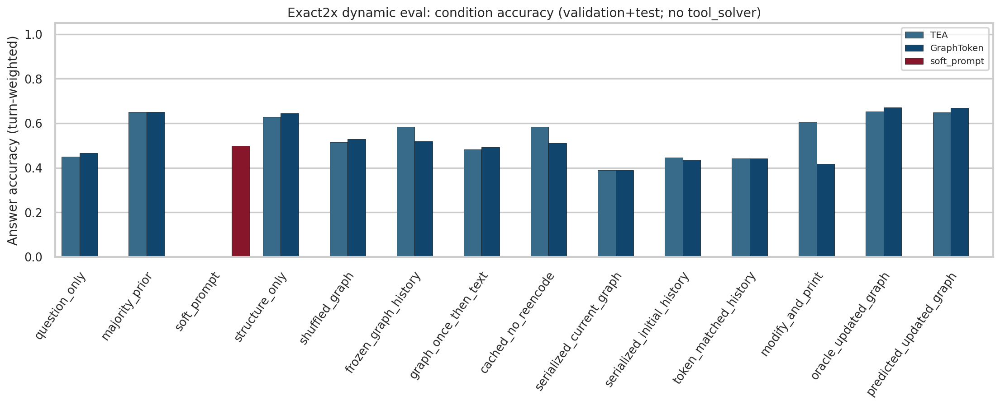
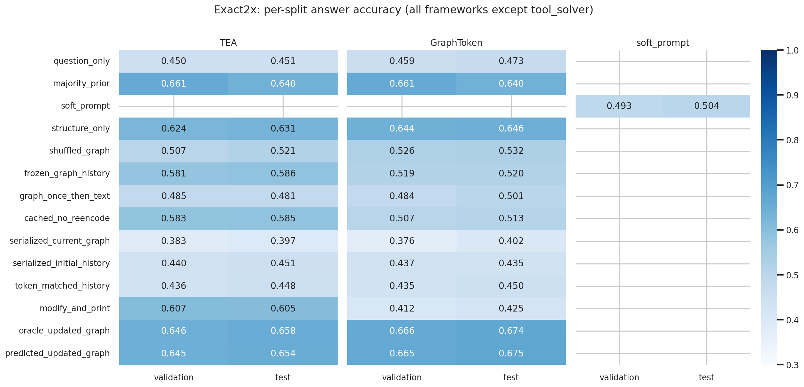
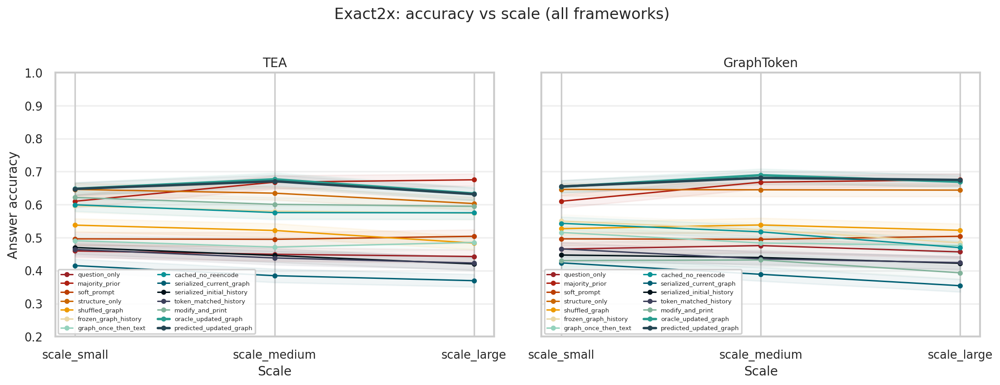
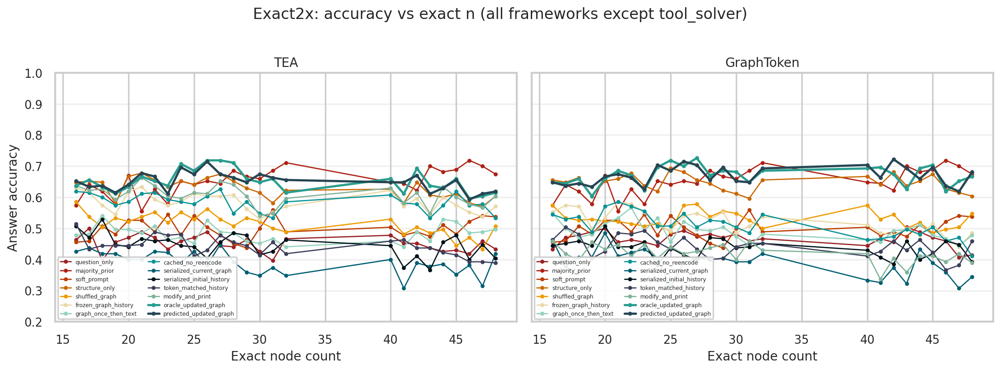
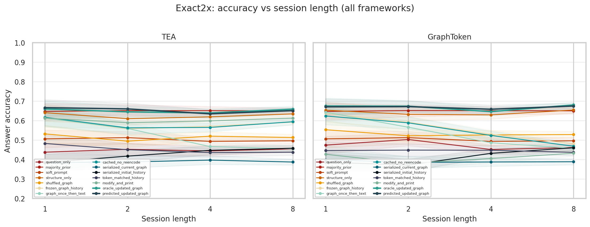
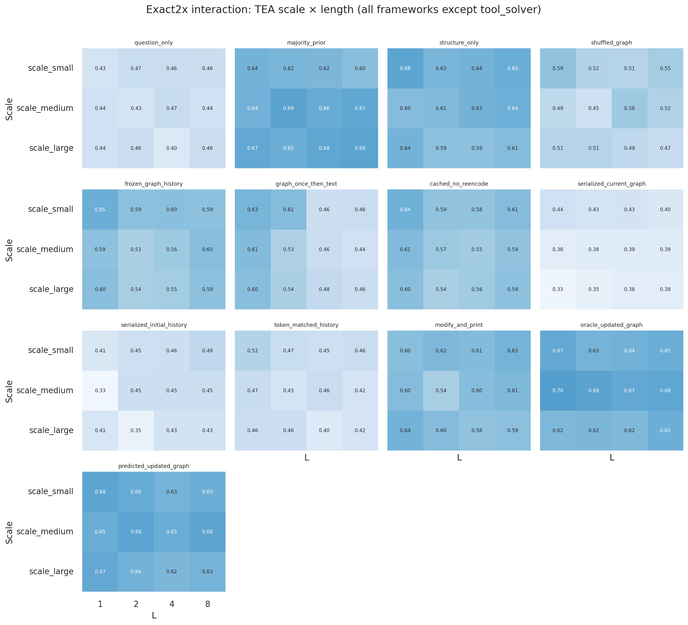
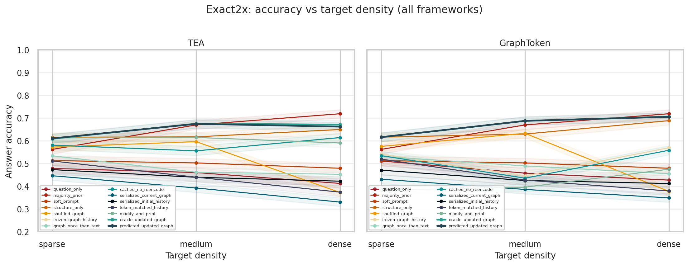
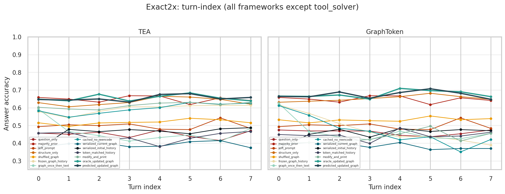
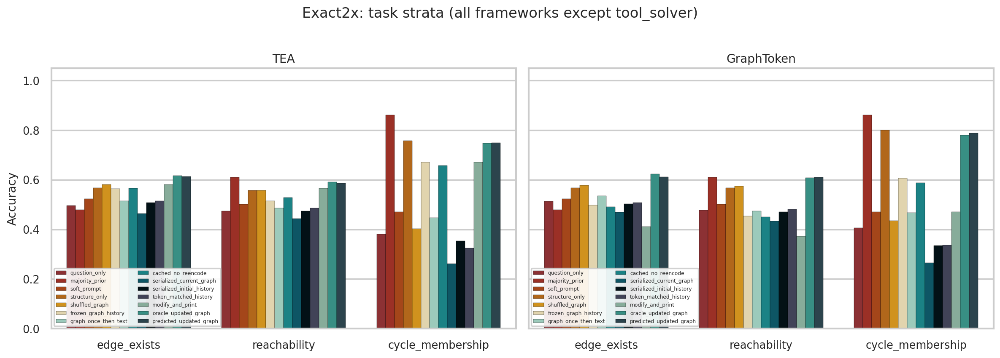
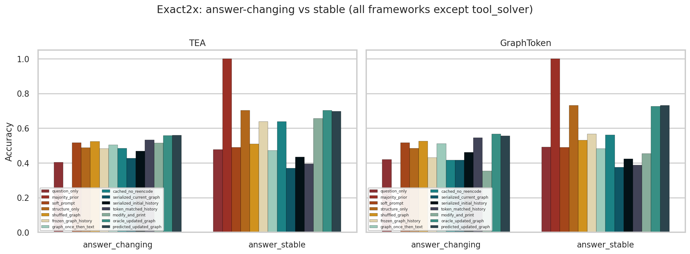

# Exact-uniform 2× eval (disentangled complexity)

**Run ID:** `v2_gate_variant_cf_exact2x-20260911`  
**Date:** 2026-09-11  
**Dataset:** [`datasets/metro_v2_gate_variant_cf_exact2x/`](../../../datasets/metro_v2_gate_variant_cf_exact2x/)  
**Configs:** [`configs/v2_gate_variant_cf_exact2x_{tea,graphtoken,soft_prompt}.yaml`](../../../configs/)  
**Checkpoints:** reused from `v2_gate_variant_cf-20260823` (no retrain)  
**Artifacts:** [`strata.json`](strata.json), `*_summary.json`, [`audit.json`](audit.json), figures `documents/experiments/figures/exact2x_*.png`

## Motivation

The factorial eval (2026-09-09) crossed **scale bins × session length** but still sampled node counts inside bins and cycled tasks within sessions. This run builds a **full exact grid**: every `(exact n × L × density × task)` once per split, with a **fixed task for the whole session**, so trends on exact size, density, length, and task are not confounded by within-session task cycling.

## Design and balance

| Axis | Levels |
|------|--------|
| Exact \(n\) | small 16–24 (9), medium 25–32 (8), large 40–48 (9) → **26** sizes |
| Session length | 1, 2, 4, 8 |
| Density | sparse / medium / dense (forced) |
| Task | `edge_exists`, `reachability`, `cycle_membership` (fixed per session) |

**1× cell count:** \(26 \times 4 \times 3 \times 3 = 936\) sessions / 3510 turns.  
**2× layout:** validation = 1×, test = 1× → **1872 sessions / 7020 turns**. Topology: Watts–Strogatz only. Static CF corpus copied; dynamics regenerated with `session_layout=exact_uniform`.

**Verified (both splits):** 936 unique cells with count 1; fixed task on all sessions; density 312/312/312; tasks 312/312/312; each exact \(n\) appears **36** times per split (uniform within bins); sparse present.

## Headline results (val+test pooled, n=7020 turns)





| Condition | TEA | GraphToken |
|---|---|---|
| `question_only` | 45.1% | 46.6% |
| `majority_prior` | 65.1% | 65.1% |
| `structure_only` | 62.8% | 64.5% |
| `soft_prompt` (own ckpt) | 49.9% | 49.9% |
| **`oracle_updated_graph`** | **65.2%** | **67.0%** |
| **`predicted_updated_graph`** | **64.9%** | **67.0%** |
| Edit-prediction accuracy | **96.4%** | **96.2%** |

Paired Δ (oracle − baseline): vs question_only **+20.1 / +20.5pp**; vs predicted **~0pp** (near-tie); vs majority **+0.1 / +2.0pp**. Multimodal gain (oracle − max(soft_prompt, structure_only)): **+2.4pp TEA / +2.5pp GT** — small because `structure_only` is already strong on this yes/no mix.

**Note on majority:** answer labels skew toward `yes` (val 2036/3510, test 1979/3510) and `cycle_membership` majority is **86.2%**, so the pooled majority prior (65.1%) is a tough headline comparator. State-tracking signal remains clearer on `edge_exists` / `reachability` (below).

## Disentangled complexity trends



**Scale (pooled):** medium easiest (TEA 67.7%, GT 68.9%); large hardest for TEA (63.4%). Small is mid (TEA 64.8%). Same qualitative ordering as factorial.



**Exact \(n\) within bins:** no sharp cliff at a single size; oracle varies smoothly inside each bin (see figure).



**Session length:** mild / near-flat (TEA 64–66%; GT 65–68%). No collapse at 8 turns once length is crossed with all sizes and tasks.



**Oracle interaction (TEA):**

| | turns=1 | 2 | 4 | 8 |
|---|---|---|---|---|
| scale_small | 0.667 | 0.633 | 0.639 | 0.654 |
| scale_medium | 0.701 | 0.688 | 0.667 | 0.676 |
| scale_large | 0.617 | 0.620 | 0.616 | 0.648 |

Medium remains strongest across lengths; large×short is among the weaker cells (not uniquely large×8).



**Density:** sparse hardest (TEA 60.9%, GT 61.6%); medium ≈ dense for TEA; dense slightly best for GT. Forced sparse coverage removes the old “sparse missing → density confounded” issue.



**Turn index:** relatively flat (oracle ~0.64–0.71 across turns 0–7), consistent with fixed task-per-session (no `turn_index % 3` cycling).

## CLEGR-style fine grain



| Task | TEA oracle / majority | GT oracle / majority |
|---|---|---|
| edge_exists | 0.617 / 0.479 | 0.624 / 0.479 |
| reachability | 0.591 / 0.611 | 0.608 / 0.611 |
| cycle_membership | 0.748 / 0.862 | 0.779 / 0.862 |

State-tracking lift over majority is clearest on **edge_exists**. Reachability is near majority; cycle is majority-dominated.



Answer-changing turns (n=2453): TEA **55.7%** acc / 43.5% pred-matches-stale; GT **56.7%** / 43.3%.

Full stratified dumps: [`strata.json`](strata.json).

## Interpretation

1. Dynamic update still beats text / stale / soft-prompt baselines on a fully balanced exact grid; predicted ≈ oracle with ~96% edit accuracy.  
2. **Scale** remains the clearer hardness axis than **length**; turn-index is flatter under fixed tasks.  
3. Pooled majority is inflated by cycle + yes skew — use task strata when claiming lift over chance.  
4. Multimodal gain vs structure_only is small (~2.5pp) on this diagnostic; absolute oracle (~65–67%) sits between the factorial (~60%) and entangled CF (~70%) headlines.  
5. Soft-prompt (~50%) still trails both GLMs.

## Prior reports (history)

- Factorial (scale×turns): [`../v2_gate_variant_cf_factorial-20260909/report.md`](../v2_gate_variant_cf_factorial-20260909/report.md)  
- Original CF (entangled OOD): [`../v2_gate_variant_cf-20260823/report.md`](../v2_gate_variant_cf-20260823/report.md)

## Reproduce

```bash
# dynamics already generated; regenerate only if needed:
python -m graph_modi.cli generate --config configs/v2_gate_variant_cf_exact2x_tea.yaml

CUDA_VISIBLE_DEVICES=0 python -m graph_modi.cli evaluate --config configs/v2_gate_variant_cf_exact2x_tea.yaml
CUDA_VISIBLE_DEVICES=1 python -m graph_modi.cli evaluate --config configs/v2_gate_variant_cf_exact2x_graphtoken.yaml
CUDA_VISIBLE_DEVICES=0 python -m graph_modi.cli evaluate --config configs/v2_gate_variant_cf_exact2x_soft_prompt.yaml
python scripts/analyze_exact2x_eval.py
```
