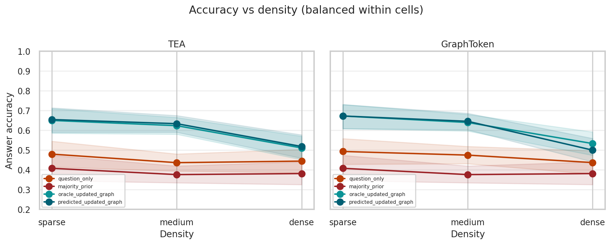
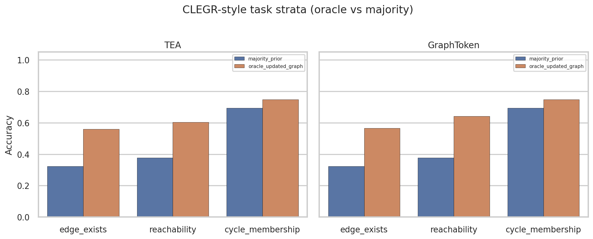
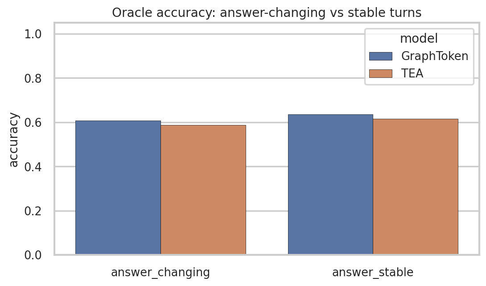

# Factorial scale×turns eval (disentangled complexity)

**Run ID:** `v2_gate_variant_cf_factorial-20260909`  
**Date:** 2026-09-09  
**Dataset:** [`datasets/metro_v2_gate_variant_cf_factorial/`](../../../datasets/metro_v2_gate_variant_cf_factorial/)  
**Configs:** [`configs/v2_gate_variant_cf_factorial_{tea,graphtoken,soft_prompt}.yaml`](../../../configs/)  
**Checkpoints:** reused from `v2_gate_variant_cf-20260823` (no retrain)  
**Artifacts:** [`strata.json`](strata.json), model `*_summary.json`, figures `documents/experiments/figures/factorial_*.png`

## Motivation

The prior CF dynamic eval entangled **large graphs** with **8-turn sessions** in the OOD split, so scale vs length trends were not identifiable. This run regenerates **dynamic eval only** on a factorial grid:

| Axis | Levels |
|------|--------|
| Scale | `scale_small` (16–24), `scale_medium` (25–32), `scale_large` (40–48) |
| Session length | 1, 2, 4, 8 |
| Density | sparse / medium / dense **balanced inside each cell** (control, not a third headline axis) |

**12 cells** × 2 val + 20 test sessions/cell → 24 + 240 sessions (90 + 900 turns). Topology fixed to Watts–Strogatz. Gate tasks unchanged. Static CF corpus copied from the original CF dataset.

## Headline results (val+test pooled, n=990 turns)

| Condition | TEA | GraphToken |
|---|---|---|
| `question_only` | 44.8% | 46.9% |
| `majority_prior` | 38.5% | 38.5% |
| `soft_prompt` (own ckpt) | 52.9% | 52.9% |
| **`oracle_updated_graph`** | **59.9%** | **61.8%** |
| **`predicted_updated_graph`** | **60.7%** | **61.2%** |
| Edit-prediction accuracy | **97.5%** | **97.2%** |

Paired Δ (oracle − baseline): vs majority ~+21–23pp; vs question_only ~+15pp (GT); vs predicted ~0pp (near-tie). Multimodal gain (oracle − max(soft_prompt, structure_only)): **+7.0pp TEA / +7.8pp GT** — smaller than the entangled CF report because the factorial mix is harder on average (large×short and small×long cells included).

## Disentangled complexity trends


**Scale (pooled over turns):** medium graphs are easiest; **large** is hardest (TEA 53.9%, GT 57.3%). Small is not uniformly best (TEA small 57.9% &lt; medium 67.9%).


**Session length (pooled over scale):** mild variation; **no collapse at 8 turns** once length is crossed with small/medium graphs. GT: 62.1% (1) → 60.2% (8). The old “OOD is hard because 8 turns” reading does not survive disentangling.


**Oracle interaction (TEA):**

| | turns=1 | 2 | 4 | 8 |
|---|---|---|---|---|
| scale_small | 0.455 | 0.659 | 0.568 | 0.580 |
| scale_medium | 0.591 | 0.727 | 0.659 | 0.688 |
| scale_large | 0.591 | 0.545 | 0.557 | 0.523 |

Large×8 is among the weakest cells; small×1 is also weak (high variance at n≈22 turns/cell on the margin). Medium remains strongest across lengths.



With density forced into the corpus, **sparse ≥ medium &gt; dense** for oracle (opposite of the old confounded dense-high pattern). Dense still carries easier `cycle_membership` skew in places, but overall sparse/medium look healthier for state-tracking.

## CLEGR-style fine grain



| Task | TEA oracle / majority | GT oracle / majority |
|---|---|---|
| edge_exists | 0.560 / 0.324 | 0.565 / 0.324 |
| reachability | 0.605 / 0.378 | 0.641 / 0.378 |
| cycle_membership | 0.747 / 0.695 | 0.747 / 0.695 |

State-tracking signal remains clearest on edge_exists / reachability. Cycle majority is still high (~70% here) though less extreme than the old 94% on the entangled set.



Answer-changing turns (n=609): TEA **58.8%** acc / 39.6% pred-matches-stale; GT **60.8%** / 39.2%. Still well above chance relative to majority, but stale-match is higher than on the original CF OOD diagnostic slice.

Full stratified dumps (scale, turns, density, hop_depth, edit_count, factorial_cell, paired deltas): [`strata.json`](strata.json).

## Interpretation

1. Dynamic update still beats text/stale/majority baselines on a **balanced** complexity grid.  
2. **Scale** is the clearer hardness axis; **length alone** is not.  
3. Prior CF “OOD drop” mixed both factors; factorial eval revises that story.  
4. Absolute oracle (~60%) is lower than the entangled CF headline (~70%) — expected under a harder, more balanced mix, not a training regression (same checkpoints).  
5. Soft-prompt still trails; multimodal gain is positive but smaller.

## Reproduce

```bash
# dataset already generated; regenerate dynamics only if needed:
python -m graph_modi.cli generate --config configs/v2_gate_variant_cf_factorial_tea.yaml

CUDA_VISIBLE_DEVICES=0 python -m graph_modi.cli evaluate --config configs/v2_gate_variant_cf_factorial_tea.yaml
CUDA_VISIBLE_DEVICES=1 python -m graph_modi.cli evaluate --config configs/v2_gate_variant_cf_factorial_graphtoken.yaml
CUDA_VISIBLE_DEVICES=0 python -m graph_modi.cli evaluate --config configs/v2_gate_variant_cf_factorial_soft_prompt.yaml
python scripts/analyze_factorial_eval.py
```
