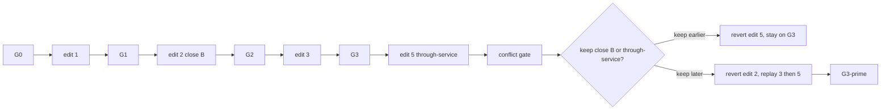

# Contradiction-Aware Repair: When Recency Is Wrong

## The one-sentence idea

Over a multi-turn revision session, a later utterance can imply a graph state that is incompatible with an earlier one — and when it does, **last-write-wins is not always what the user wants**. The contribution is not detecting that conflict (a solver already can) and not localizing the culprit edit (replay already can). It is recovering a resolution target that is *not derivable from the graph, the log, or recency* — by naming the earlier change that the new revision contradicts, asking the user which one to keep, and then repairing the history to match that choice.

---

## Where this comes from

GraphModi's loop is:

```text
revision -> parse edit -> validate/apply -> G_t -> encode -> graph tokens -> LLM -> answer
```

Edits are cumulative. Turn three applies to `G_2`, never to the original graph. The current generator is built around that assumption: each turn's edit is sampled from the *current* graph, the audit requires the gold answer to change, and the session is a strictly consistent trajectory. There is no notion of a later revision that cannot sit on top of an earlier one.

That is a design choice, not a property of the task. Real revision dialogue does this constantly:

```text
Turn 2:  "Close station B for maintenance."
Turn 5:  "The B–C line is now a through-service again."
```

Turn 5 is not a NOOP and it is not a clean reversal. It is an utterance whose implied graph state is incompatible with the closure still sitting in the log. Three things can happen:

```text
last-write-wins     →  reopen B, discard the closure, never mention it
refuse the new edit →  keep B closed, never mention the conflict
ask                 →  "Turn 2 closed B. Keep the closure, or take the through-service?"
```

Every conflict-resolution system we found in the 2024–2026 sweep — and every instruction-tuned model that has been measured on conflicting instructions — does the first of those. Recency wins. Asking only earns its keep on items where **recency is wrong**: the user meant the earlier edit to stand, and the later utterance was a slip, a stale fact, or a local change that should not overwrite the earlier one.

That is the hole. The rest of this document is about whether GraphModi is a place to occupy it, and what would kill the attempt.

---

## A contradiction exists iff two revisions imply incompatible graph states

Both logical and semantic contradictions are in scope, but both are **graph-grounded**. An utterance pair is contradictory when there is no single attributed graph that satisfies both implied states. We do not score free-text self-contradiction, and we do not score "the model said two incompatible things about the world." The unit is a pair of revisions and the graphs they commit.

| Kind | What it looks like | Who can decide it | Already in this repo? |
|------|--------------------|-------------------|------------------------|
| **Invariant violation** | The new edit cannot apply: unknown node, duplicate edge, self-loop, dangling endpoint | `validate_graph` / `apply_edit` | Yes. This is the executor guard, not a research question. |
| **Silent incompatibility** | Each edit applies alone; together they produce a graph that violates a *task* invariant the executor does not enforce (e.g. "the ring stays connected", "line 3 remains a cycle", mutually exclusive attributes that the schema does not constrain) | A solver over the edit log plus an explicit invariant | No. The current validator does not check connectivity, attribute domains, or cross-turn mutual exclusion. |
| **Intent conflict** | Both edits apply, the graph stays valid, but the two revisions cannot both be what the user meant (close B *and* run through-service on B–C) | Not derivable from G or the log. Requires a keep-decision. | No. And this is the only kind where last-write-wins can be *wrong by construction*. |

The first row is already solved. Writing a paper about detecting `DEL EDGE` of a nonexistent edge is writing a paper about `apply_edit`. The second row is solver-decidable once the invariant is stated; a non-neural baseline will score ~100% on detection and on culprit localization. The third row is the only one whose gold label cannot be computed from the session without an extra annotation: **which revision the user intended to keep**.

So the dataset, not the detector, is the contribution surface. If we cannot generate sessions whose gold keep-decision is *not* recency, there is nothing to measure that a last-write-wins baseline does not already get.

---

## The mechanism (instrumental, not the claim)

The pipeline as originally conceived — detect, attribute, ask, repair — is a solved loop on other substrates. We still need it, because you cannot ask a well-posed question without naming the culprit edit, and you cannot apply the user's answer without rewriting history. Treat the four steps as machinery.

```text
incoming revision
        │
        ▼
   parse typed edit
        │
        ▼
   conflict gate ──no──► apply, re-encode, answer     (today's loop)
        │
       yes
        │
        ▼
   attribute: replay / bisect the log
        │
        ▼
   ask: "keep edit j, or take edit k?"
        │
        ▼
   repair: revert the loser, replay the suffix, re-encode
```

### Detect

A conflict gate sits in front of commit. For invariant violations the gate is `apply_edit` returning `applied=False`. For silent incompatibilities the gate is: apply tentatively, then check a stated invariant (connectivity, cycle membership, attribute domain) against the resulting graph *and* against the implied state of earlier revisions. For intent conflicts the gate is a pair of implied states that cannot be jointly satisfied — which, in a controlled generator, is a label we planted, not a judgment the model has to invent.

### Attribute

Given a detected conflict at turn `k`, find the **minimal earlier edit set** whose presence makes `k` incompatible. The algorithm is not learned:

```text
replay G_0 … G_{k-1} from the snapshot log
bisect / delta-debug the prefix
the culprit is the latest edit j whose removal lets k apply
    (or the minimal hitting set of such edits, if several)
```

`materialize_states` already reconstructs `G_0 … G_t` from `Session.initial_graph` plus per-turn fingerprints. A symbolic baseline that does this will get ~100% culprit localization on invariant violations and silent incompatibilities. Attribution is therefore *instrumental*: it produces the arguments of the question. It is not a result.

### Ask

One discriminating question, binary in the typical case:

> Turn 2 closed station B. Turn 5 puts through-service on B–C. Which should stand?

This is a split-in-half query over two diagnoses. Information-optimal query selection over a larger diagnosis set exists (see grounding). We do not claim to have invented asking.

### Repair

The user's answer names a survivor. Revert the loser, replay every subsequent edit that still applies, drop the ones that no longer do, re-encode the resulting graph, and continue. The resolution target — the graph the user actually wanted — is the only quantity a solver cannot compute.



---

## Grounding: what exists, what doesn't (checked against 2024–2026 literature)

We ran a literature sweep on detection, attribution, interactive repair, and graph-token substrates. Honest summary: **the pipeline is crowded. The recency-is-wrong hole is not.**

**Detection over multi-turn dialogue is near-solved, and disclosure is the actual failure.**

- *DECODE* (ACL 2021) already ships `aggregated_contradiction_indices` — the turn indices of the supporting evidence — on text-only dialogue. Attribution is to an utterance, not to a state mutation, and there is no repair.
- *VISTA* (ACL 2026) decomposes each turn into atomic claims and verifies them against dialogue history; contradiction is one of its unverifiable categories. Text-side, no world state, no edit log.
- *ConInstruct* (AAAI 2026, [arXiv:2511.14342](https://arxiv.org/abs/2511.14342)) is the uncomfortable result for anyone pitching "can the model notice?": detection F1 is 91.5 for DeepSeek-R1 and 87.3 for Claude-4.5-Sonnet, but models almost never *tell* the user. GPT-4o answers anyway 97.5% of the time; the best model alerts in 45% of cases. Detection is not an open question. Disclosure is closer, and ConInstruct has already staked it — on instruction constraints, not world state.
- *IHEval* (NAACL 2025) adds the other uncomfortable result: models already handle "previous turn conflicts with current turn" well, because instruction tuning trains recency-wins.
- *SKG-Eval* (2026, [arXiv:2605.16650](https://arxiv.org/abs/2605.16650)) is the closest graph-shaped neighbor. It incrementally builds a semantic KG from dialogue and runs a geometric contradiction engine (negation flips, antonyms, numeric mismatch), with revision-aware filtering that distinguishes accidental inconsistency from intentional user-directed update. It is an *evaluator*. It does not re-encode through a GNN, does not localize a causing edit, and does not ask the user anything.

**Attribution of the causing earlier step is a named, benchmarked task — and in our setting it is trivial.**

- *Who&When* (ICML 2025 spotlight, [arXiv:2505.00212](https://arxiv.org/abs/2505.00212)) formalizes "identify the responsible agent and the decisive error step," with All-at-Once, Step-by-Step, and Binary Search (git-bisect). Best reported: 53.5% who, **14.2% when**. That number is encouraging for *text* traces. Our traces are typed edits over a replayable graph. Replay-plus-bisect with a decision procedure is exact.
- *TokenMizer* (2026, [arXiv:2606.06337](https://arxiv.org/abs/2606.06337)) stores `DecisionTransition` records: which message caused a decision to be superseded, why, the quoted evidence, a confidence delta. Attribution over an edit history in a graph-structured session store, done.
- Graph-structured, provenance-carrying, supersession-typed memory is a 2026 cluster, not a gap: *Graphiti/Zep* (2025, [arXiv:2501.13956](https://arxiv.org/abs/2501.13956)) temporally invalidates conflicting edges (`invalid_at` / `expired_at`); *TEPA* (2026, [arXiv:2608.07429](https://arxiv.org/abs/2608.07429)), *MOSAIC* (2026, [arXiv:2607.16211](https://arxiv.org/abs/2607.16211)), and *SodaMem* (2026, [arXiv:2608.08055](https://arxiv.org/abs/2608.08055)) all detect conflict at write time and resolve by supersession. All of them assume the newest statement is the truth.

**Interactive detect → pinpoint → query → repair was built in 2012.**

- *Interactive ontology debugging: two query strategies for efficient fault localization* (Shchekotykhin, Friedrich, Fleiss & Rodler, *Journal of Web Semantics* 2012, [arXiv:1107.4303](https://arxiv.org/abs/1107.4303)) is the hostile-reviewer citation. Candidate diagnoses, then a sequence of discriminating queries to a user oracle, split-in-half and entropy / information-gain selection, then repair. *RIO* ([arXiv:1209.3734](https://arxiv.org/abs/1209.3734)) minimizes the number of questions. A binary "keep the closure or the through-service?" is the 2012 split-in-half baseline.
- *LogicVault* (ICLR 2026 workshop) is the same pipeline with text as the substrate: persistent symbolic belief vault, Z3, the minimal unsatisfiable core fed back to the LLM, plus an AGM belief-revision module. 78% reduction in cross-query contradictions. No user interaction, no graph encoder — but no reviewer will accept "we put an LLM in front of a solver" as the delta.
- Clarification-when-to-ask is its own 2025–2026 cluster (*ClarifyMT-Bench*, [arXiv:2512.21120](https://arxiv.org/abs/2512.21120); *SAGE-Agent / ClarifyBench*, [arXiv:2511.08798](https://arxiv.org/abs/2511.08798), EVPI over tool parameters). Part (c) of the original proposal is the most crowded of the three.

**Nobody does this on a GLM's encoded input graph.**

Searched against the graph-soft-prompt line (GraphPrompter, TEA-GLM, GraphToken) and against `"graph language model" contradiction`. Nothing detects contradictions *among successive edits to* a GNN-encoded input graph. That is a real gap, and it is narrow. It supports a probe, not a system. Against it sits the validity threat already in the project: [arXiv:2605.03514](https://arxiv.org/abs/2605.03514) found graph-token LLMs largely structure-blind — TEA-GLM's accuracy moved 0.02 under adversarial edge rewiring. If the model cannot see rewiring, it will not see an invariant violation through the graph-token channel, and any working detector in this system will be the symbolic validator.

**Verdict: crowded except for one hole.** The detect → attribute → clarify → repair pipeline has been built end-to-end at least twice (JWS 2012 over description logics; LogicVault 2026 over LLM belief states). Contradiction over an incrementally built dialogue graph is SKG-Eval. Contradiction → supersession with provenance is shipping. "Which earlier step caused this" is an ICML 2025 named task. What nobody constructs is a multi-turn *state-editing* benchmark whose gold resolution is **not recency** — where applying the latest revision is the wrong answer, and the only way to recover the intended graph is to ask.

---

## Kill-switch probe (the one figure)

Before investing in a contradiction generator, a clarification loop, or a rebase path, run one figure. Question:

> Can a structural contradiction be read from graph soft tokens at all?

Take a session, inject an oracle-known invariant violation at turn `k` (or a silent incompatibility against a stated invariant), and ask the model a yes/no: *is the current world consistent with the revisions so far?* Three conditions, identical items:

| Condition | What the model sees |
|-----------|---------------------|
| **(a) graph tokens only** | Re-encoded post-edit `G_k`. No transcript. |
| **(b) serialized edited graph** | Current graph as text. No GNN. |
| **(c) frozen graph + transcript** | `G_0` tokens plus the full revision history. |

Prediction from the structure-blindness result: (a) fails, (b) and (c) succeed. If that is what happens, the GLM is not in the detection loop, the symbolic gate is doing all the work, and this direction is dropped for the price of one experiment rather than pursued on faith.

A shuffled-violation control belongs on the same figure: if (a) "detects" a contradiction when the injected edit is a no-op or a permutation that preserves the invariant, the channel is not carrying the content.

Decision rule:

- (a) strictly above chance, and strictly above a shuffled control, on silent incompatibilities → the encoder channel is legible enough to continue.
- (a) at chance, or matching the shuffled control → stop. Detection will be the validator. The only remaining claim is recency-is-wrong repair, which does not need graph tokens.

---

## Mandatory baselines

A reviewer will demand all four. If any one of them matches the system on the quantity we claim to move, the framing collapses.

1. **Symbolic constraint solver over the edit log.** Replay + invariant check + minimal-conflict-set enumeration (MUPS / Reiter hitting sets). This will get ~100% on detection and attribution for invariant violations and silent incompatibilities. The paper is not allowed to report those two numbers as wins against this baseline. The baseline is there to prove we are not claiming them.

2. **Text-only LLM reads the transcript**, plus a **transcript + serialized-edited-graph** variant. Given ConInstruct and IHEval, expect this to be strong on detection and on recency-wins resolution. It is the honest competitor on the disclosure and clarification halves.

3. **Last-write-wins / recency-wins, no attribution, no clarification.** Always commit the new edit. This is the product default (TEPA, Graphiti, instruction-tuned models). It is also the baseline that is *guaranteed to fail* on the recency-wrong subset. If our system does not beat LWW on that subset, asking was theater.

4. **Oracle-attribution ablation.** Give the system the true culprit edit for free, then ask and repair. If end-task accuracy (post-repair state exactness against the intended graph) does not move relative to asking without localization, attribution is not the bottleneck and should not be in the title.

---

## Dataset implications

The current generator cannot produce this task. That is a fact about the code, not a complaint.

Sessions in `src/graph_modi/data/multiturn.py` (and the v2 multi-edit sampler) are **anti-contradiction by construction**:

- turn `k` is applied to the graph produced by turns `0 … k−1`
- `_candidate_edit` samples from the *current* graph (SET toggles `status`, ADD picks an unconnected pair, DEL picks an existing edge)
- `audit_sessions` requires `stale_answer != gold_answer` on every non-NOOP turn, and requires the gold edit to apply

The result is a trajectory that reverses or extends prior edits, never one that conflicts with them. There is also no interactivity hook: `Session.turns` is a fixed linear script, `ModelInput.history` is past revision text, and evaluation conditions test stale-graph failure modes, not a clarification turn.

A contradiction split needs, at minimum:

| Field | Why |
|-------|-----|
| `contradicts_turn_j` | Gold that turn `k` is incompatible with a specific earlier turn |
| `culprit_edit_index` (or a set) | Gold for attribution; must survive replay |
| `keep_decision` ∈ {`earlier`, `later`, `amend`} | Gold for repair. **This is the label LWW cannot infer.** |
| `intended_graph` / `intended_fingerprint` | What `G` should be after the user's answer |
| planted invariant, if silent | So the solver baseline has something to check |

The sampler has to draw the later edit from an *earlier ancestor state*, not from `G_{k-1}` — otherwise the new edit is always operationally applicable. The recency-wrong subset is the one where `keep_decision = earlier` (or `amend` in a way that is not last-write-wins). If that subset is empty, do not generate the rest.

Gold answers stay solver-computable *after* the keep-decision is applied: replay the repaired log, run `answer_query` on the intended graph. The keep-decision itself is the one label the solver does not get to see.

---

## Metrics

Report the pipeline pieces separately so a 100% symbolic detector cannot hide inside an end-task number.

| Metric | What it measures | Who is allowed to win |
|--------|------------------|------------------------|
| `detect_precision` / `detect_recall` | Conflict gate at turn `k` | Symbolic baseline, by construction, on rows 1–2 of the taxonomy |
| `culprit_exact` / `culprit_set` | Localized edit index (or set) matches gold | Symbolic baseline, by construction, on the same rows |
| `question_asked` / `question_count` | Whether and how often the system asked | Us, against LWW (which asks 0 times) and against the text LLM (which ConInstruct says mostly will not) |
| `keep_decision_correct` | The asked question plus the user's (simulated) answer recovers the gold keep-decision | Us. LWW gets this only on the recency-right subset. |
| `post_repair_state_exact` | Fingerprint of the repaired graph matches `intended_fingerprint` | The actual end-task number |
| `recency_wrong_accuracy` | `post_repair_state_exact` restricted to `keep_decision != later` | **The number the paper lives or dies on.** LWW is 0 here. |

Do not lead a results table with `detect_recall`.

---

## What would kill this

- The kill-switch probe fails and we have no recency-wrong items either → there is no paper, only a validator.
- We generate recency-wrong items but LWW-plus-a-prompted-LLM ("the user may not mean the latest revision") matches `recency_wrong_accuracy` → asking with named attribution is unnecessary.
- The oracle-attribution ablation does not move `post_repair_state_exact` → stop putting "find the earlier change" in the claim.
- The symbolic baseline is the only thing that detects and attributes, *and* the clarification question is a template filled from its output → the GLM is decorative. Say so and either drop the direction or shrink the claim to "a generator and a benchmark for recency-wrong repair," which is a dataset paper.
- Intent-conflict items cannot be given gold keep-decisions without human annotation, and we refuse to break the project's exact-match-against-a-solver discipline → the only remaining items are solver-trivial, and we are back to the first bullet.

---

## The narrowest defensible claim

> A multi-turn graph-editing benchmark in which some later revisions are planted to contradict an earlier committed edit, the gold resolution is *not* last-write-wins, and a system that localizes the culprit edit, asks which revision to keep, and rebases the log recovers the intended graph where recency-wins and transcript-only prompting do not.

Everything above that sentence is framing. That sentence is what has to survive review. It does not mention graph soft tokens, because the kill-switch may take those off the table; if the probe passes, they can be added as a mechanism clause, not as the claim.

---

## What this would need from the pipeline

Self-contained, independent of any other extension:

1. **A conflict gate before commit.** `apply_edit` already covers invariant violations. Silent incompatibilities need an explicit invariant checker on the tentative post-edit graph. Intent conflicts need a planted label from the generator, because they are not a property of `G`.
2. **A retained snapshot log.** Runtime today keeps only the current graph. `materialize_states` can reconstruct history after the fact; attribution and repair need the snapshots (or an equivalent replay) *during* the session.
3. **Revert-plus-replay of the suffix.** Drop or keep the named edit, re-apply everything after it, re-encode, continue. There is no interactivity hook in the current pipeline — `Session.turns` is a script — so the clarification turn is greenfield: a new turn type, a simulated user answer drawn from `keep_decision`, and evaluation conditions that score the post-repair state.

The version-tree sketch in [branching-worlds.md](branching-worlds.md) (branch / checkout / discard) happens to supply (2) and (3) if someone builds it. The state-trajectory framing in [mutable-state.md](mutable-state.md) is adjacent in that a repair is one more transition `S_t → S_{t+1}`. Neither is a prerequisite, and this direction should not be picked or dropped on the strength of either.
